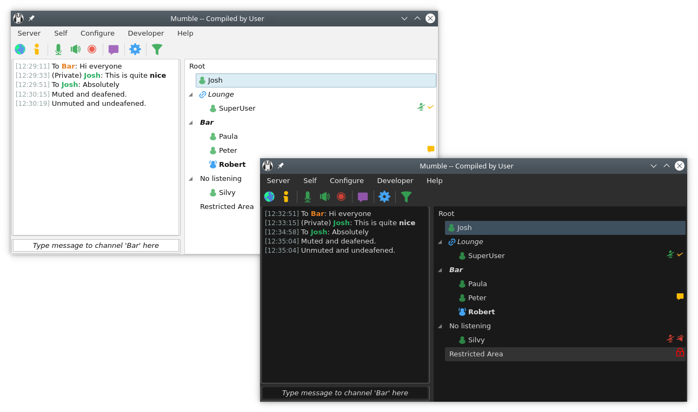

# Mumble - Open Source voice-chat software

[](https://www.mumble.info)

[](https://matrix.to/#/#mumble:matrix.org)

[](https://app.codacy.com/manual/mumble-voip/mumble)
[](https://dev.azure.com/Mumble-VoIP/Mumble)
[](https://cirrus-ci.com/github/mumble-voip/mumble)
[](https://travis-ci.com/mumble-voip/mumble)

Mumble is an Open Source, low-latency and high-quality voice-chat program
written on top of Qt and Opus.

There are two modules in Mumble; the client (mumble) and the server (mumble-server formerly known as murmur).
The client works on Windows, Linux, FreeBSD, OpenBSD, and macOS,
while the server should work on anything Qt can be installed on.

The documentation of the project can be found on [the website](https://www.mumble.info/documentation/).


## Contributing

We always welcome contributions to the project. If you have some code that you would like to contribute, please go ahead and create a PR. While doing so,
please try to make sure that you follow our [commit guidelines](COMMIT_GUIDELINES.md).

If you are new to the Mumble project, you may want to check out the general [introduction to the Mumble source code](docs/dev/TheMumbleSourceCode.md).

### Translating

Mumble supports various languages. We are always looking for qualified people to contribute translations.

We are using Weblate as a translation platform. [Register on Weblate](https://hosted.weblate.org/accounts/register/), and join [our translation project](https://hosted.weblate.org/projects/mumble/).

### Writing plugins

Mumble supports general-purpose plugins that can provide functionality that is not implemented in the main Mumble application. You can find more
information on how this works and how these have to be created in the [plugin documentation](docs/dev/plugins/README.md).

## Building

For information on how to build Mumble, check out [the dedicated documentation](docs/dev/build-instructions/README.md).

Make sure to switch to the appropriate branch in this repository to get the correct build documentation. The current ``master`` branch contains
the unstable code for a future release of Mumble. If you want to build an already released stable version of Mumble, e.g. ``1.5.735``, select the
corresponding branch, e.g. ``1.5.x``, in the dropdown menu above. Alternatively, use the documentation in the respective release tarball.


## Reporting issues

If you want to report a bug or create a feature request, you can open a new issue (after you have checked that there is none already) on
[GitHub](https://github.com/mumble-voip/mumble/issues/new/choose).


## Code Signing

We graciously acknowledge that this program uses free code signing provided by
[SignPath.io](https://signpath.io?utm_source=foundation&utm_medium=github&utm_campaign=mumble), and a free code signing certificate by the
[SignPath Foundation](https://signpath.org?utm_source=foundation&utm_medium=github&utm_campaign=mumble).

## Windows

### Running Mumble

After installation, you should have a new Mumble folder in your
Start Menu, from which you can start Mumble.

### Running Mumble-Server

Double-click the icon to start ``mumble-server``. There will be a small icon on your
taskbar from which you can view the log.

To set the superuser password, run ``mumble-server`` with the parameters `-supw <password>`.


## MacOS

### Running Mumble

To install Mumble, drag the application from the downloaded
disk image into your `/Applications` folder.

### Running Mumble-Server

``mumble-server`` is distributed separately from the Mumble client on MacOS.
It is called Static OS X Server and can be downloaded from the main webpage.

Once downloaded it can be run in the same way as on any other Unix-like system.
For more information please see the "Running mumble-server" in the Linux/Unix section below.


## Linux/Unix

### Running Mumble

If you have installed Mumble through your distribution package
repository, you should be able to find Mumble in your start menu. No
additional steps are necessary.

### Running Mumble-Server

``mumble-server`` should be run from the command line, so start a shell (command prompt)
and go to wherever you installed Mumble. Run ``mumble-server`` as

```
mumble-server [-supw <password>] [-ini <inifile>] [-fg] [v]

-supw   Set a new password for the user SuperUser, which is hardcoded to
        bypass ACLs. Keep this password safe. Until you set a password,
        the SuperUser is disabled. If you use this option, mumble-server will
        set the password in the database and then exit.

-ini    Use an inifile other than mumble-server.ini, use this to run several instances
        of mumble-server from the same directory. Make sure each instance is using
        a separate database.

-fg     Run in the foreground, logging to standard output.

-v      More verbose logging.
```

#### Docker image

Our official Docker image along with instructions on how to use it can be found at https://github.com/mumble-voip/mumble-docker


### Server configuration

You can find an up-to-date ``mumble-server`` configuration template in [this repository](auxiliary_files/mumble-server.ini).
Further server configuration documentation can be found [on the project website](https://www.mumble.info/documentation/administration/).

### OpenGL Overlay

The OpenGL overlay works by intercepting the call to switch buffers, and just
before the buffer switch, we draw our nice GUI.

To load a game with the overlay enabled, start the game like this:
```bash
LD_PRELOAD=/path/to/libmumble.so.1.1 gamename
```

If you have Mumble installed through the binary packages, this can be done by
simply typing:
```bash
mumble-overlay gamename
```
