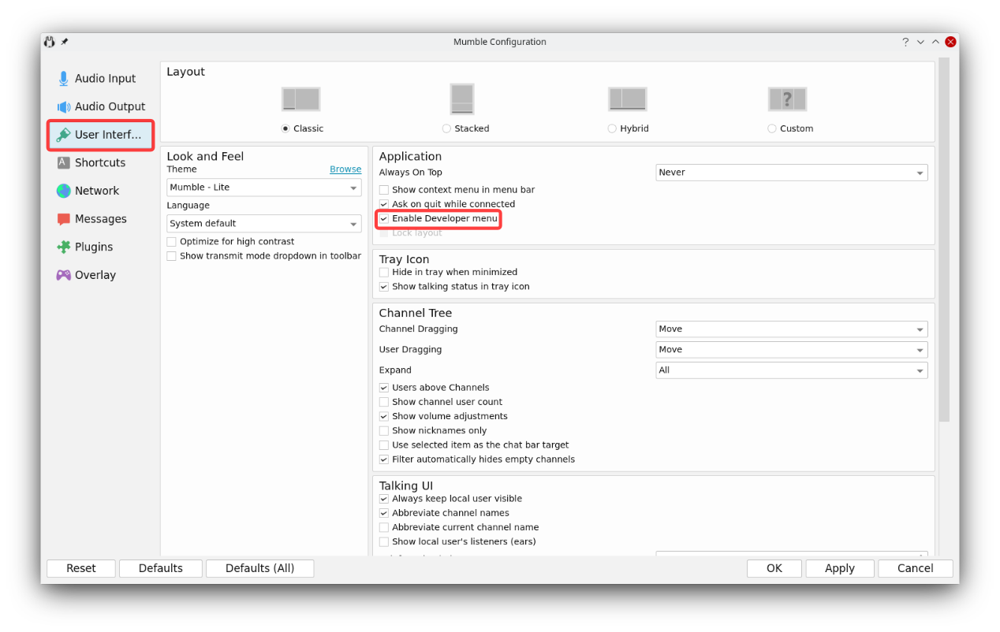
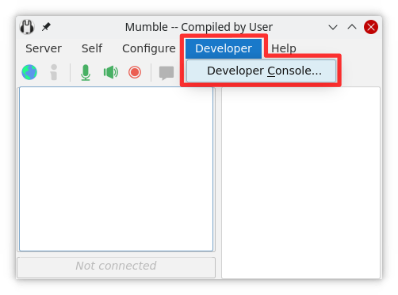

# Developer console

The _Developer console_ shows information logged by Mumble that can be of interest to developers. This is usually used to find the cause
of certain bugs.

## How to open the Developer console?

1. Make sure the developer menu is enabled in the settings (checkbox in the "User interface" section)

2. Open the Developer console from the new menu entry in the main window

