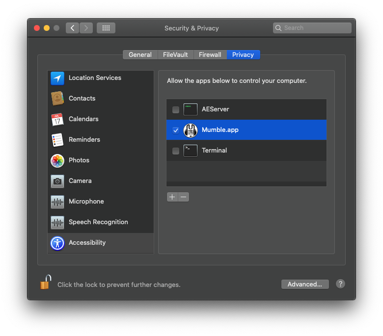

# Global shortcuts

## Windows

No additional steps should be required.

If you're encountering problems, feel free to open an issue.

## Linux

### Poll-driven engine

Uses a little more processing power, but no additional steps are required.

### Event-driven engine

Mumble needs read permissions for `/dev/input/event*`.

The solution usually consists in adding your user to the `input` group:

```
sudo usermod -a -G input user
```

Please note that this allows any applications running under the same user
to read data sent by input devices.

If the solution doesn't work for you, you could allow all users to read the input:

```
  sudo chmod a+r /dev/input/event*
```

Please note that this is only meant to be a temporary solution, because:

- It will most likely only last until the next reboot
(at which point devfs is recreated).
- It allows any applications to read the input data,
regardless of the user they're running under!

## macOS

Mumble needs to be granted accessibility permissions.


