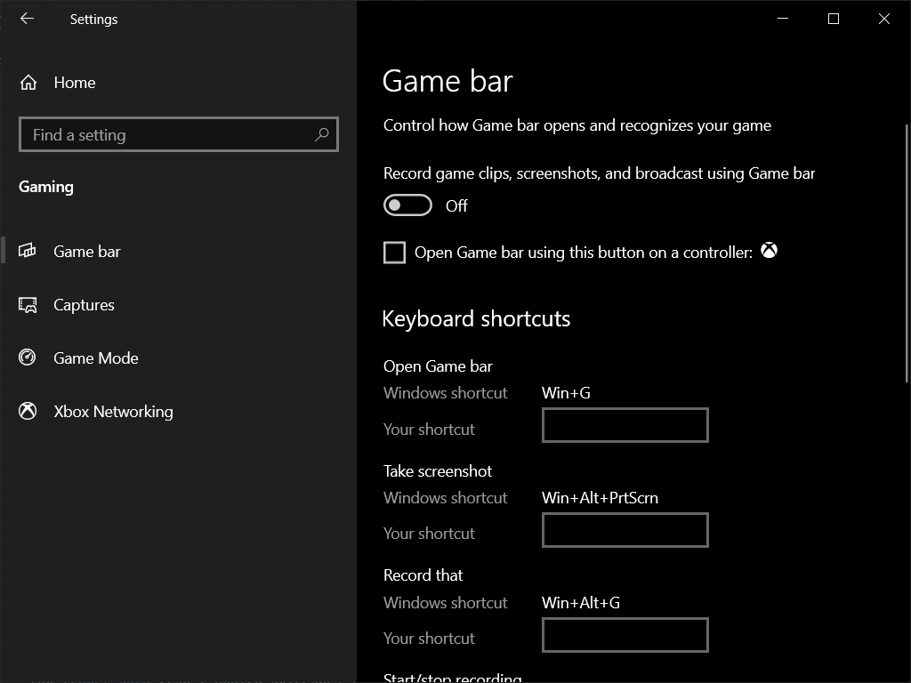
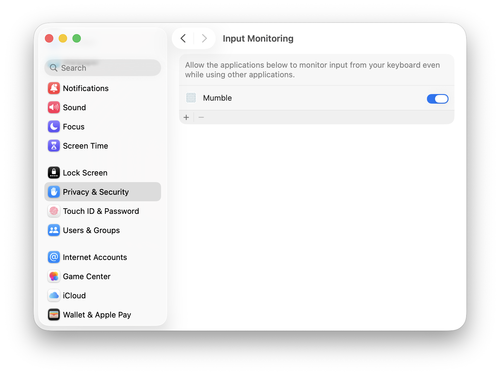

# Global shortcuts

## Windows

### Generic devices

No additional steps should be required.

If you're encountering problems, feel free to open an issue.

### Xbox controllers

If you want to use the guide button in Mumble,
the trigger for the Game bar must be disabled.



When the option is enabled, Windows doesn't pass the input to applications.

Even `XInputGetStateEx()` doesn't detect it!

## Linux

### Poll-driven engine

Uses a little more processing power, but no additional steps are required.

### Event-driven engine

Mumble needs read permissions for `/dev/input/event*`.

The solution usually consists in adding your user to the `input` group:

```
sudo usermod -a -G input user
```

Please note that this allows any applications running under the same user
to read data sent by input devices.

If the solution doesn't work for you, you could allow all users to read the input:

```
  sudo chmod a+r /dev/input/event*
```

Please note that this is only meant to be a temporary solution, because:

- It will most likely only last until the next reboot
(at which point devfs is recreated).
- It allows any applications to read the input data,
regardless of the user they're running under!

## macOS

Mumble needs permission to monitor keyboard and mouse input for global shortcuts
(e.g. Push-to-Talk) to work. The required permission depends on your macOS version:

### macOS 10.15 (Catalina) and later

Grant **Input Monitoring** permission:

1. Open **System Settings** > **Privacy & Security** > **Input Monitoring**
2. Enable the checkbox next to **Mumble**



### macOS 10.9 - 10.14

Grant **Accessibility** permission:

1. Open **System Preferences** > **Security & Privacy** > **Privacy** > **Accessibility**
2. Click the lock to make changes, then enable the checkbox next to **Mumble**


Mumble will automatically detect your macOS version and open the correct settings pane.
