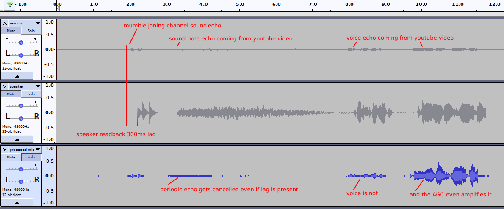

# Debugging AudioInput

Mumble does quite a bit of signal processing on the raw microphone input, so if something breaks it may not be immediately apparent _where_ it breaks.

For this reason, the `--dump-input-streams` option was added, to help tap into various parts of the DSP chain, and find where the issue is. Consider
it a bit like the digital equivalent of probing with an oscilloscope the signal path of an analog audio gear.

As the option was introduced to debug the echo canceller, the default tap points are at the input and output of that algorithm, but if you are going
to debug some C++ code, you should not have problems moving a `write()` to an `ofstream` here and there should you need to, right?

## How to use `--dump-input-streams`

You'll need to run Mumble from the command line, and the directory from where you run it will be where the dumped files will be written.

```
$ ./mumble --dump-input-streams
```

Then log into a server as usual, and start using Mumble. It's usually good enough to just run it for 10/20 seconds and then quit. Unless your bug
happens only after some time or occurs at random, there's no need to accumulate gigabytes of dumped audio. It's also best to make reproducible tests,
like playing the same video or speaking the same phrase, so as to compare results.

After closing Mumble, there should be 3 new files in the directory you launched it from:

* `raw_microphone_dump`
* `speaker_dump`
* `processed_microphone_dump`

Please note that if you run Mumble again, those files will be overwritten. Also, those files are overwritten whenever the `AudioInput` class is
reinstantiated, such as when going though the audio wizard. If you find it difficult to get the data you want, such as because closing the audio
wizard clears your files, terminate Mumble with Ctrl-C at any moment and the files won't be erased.

### Opening the files

These files contain the raw PCM streams that have been sampled. No header, no file format; nothing. Just data.
This makes the dumping code as simple as possible, and you also don't have to change the header every time you tap a point with a different sample
rate or encoding, as there's no header.

To open the raw files, you can use Audacity. Select `File > Import > Raw Data`.

Since there's no metadata, Audacity will ask you what's in those files:

* Encoding is `Signed 16 bit PCM` in the default tap point (i.e. you haven't modified `write()`). Mumble's signal path is partly 16 bit and partly
  float, so remember to select `32 bit float` if you move the tap points to some float part of the Mumble audio path.
* Byte order is `Little-endian` if you're on an x86 CPU, which you most likely are.
* Channels is always `1` for the microphone signal path, but may be more for the speaker readback if you use multichannel echo cancellation.
* Sample rate is `48000` for the default tap point, as Mumble's audio chain resamples everything to 48KHz regardless of what your audio card is
  configured to. Change accordingly when tapping before the resampler.

In Audacity you can open multiple tracks and mute them individually, so it's usually a good idea to open all three tracks to compare.

## Debugging the echo canceller

The audio dumps have an additional property that is fundamental for debugging the echo canceller: the're synchronous. If you open them all in
Audacity, you'll be able not only to see what gets passed to the echo canceller, but the relative time between the signals.

This is fundamental for an echo canceller, which can break simply because the microphone data arrives before the speaker one (how can the echo
canceller predict an echo from the future?), or if the speaker data is so ahead that exceeds its limited filter length.

### The `--print-echocancel-queue` option

Now that I've mentioned the requirement for the echo canceller to have well aligned inputs, maybe it's best to introduce the
`--print-echocancel-queue` option. When running Mumble with this option, the current state of the queue in the Resynchronizer class is used to align
the microphone and speaker readback streams is printed on the command line. Moreover, if packets are dropped (which is necessary to keep the signals
aligned if the OS/pulseaudio/audio card is playing tricks to us), those will be printed as well.

### The Resynchronizer class

Documentation on the Resynchronizer class is put as a comment in the `AudioInput.h` file, but it doesn't hurt to repeat it here, also because the
statemachine design doesn't fit in a C++ comment as it's an image.

According to https://www.speex.org/docs/manual/speex-manual/node7.html
"It is important that, at any time, any echo that is present in the input
has already been sent to the echo canceller as echo_frame."
Thus, we artificially introduce a small lag in the microphone by means of
a queue, so as to be sure the speaker data always precedes the microphone.

There are conflicting requirements for the queue:

* it has to be small enough not to cause a noticeable lag in the voice
* it has to be large enough not to force us to drop packets frequently
  when the addMic() and addEcho() callbacks are called in a jittery way
* its fill level must be controlled so it does not operate towards zero
  elements size, as this would not provide the lag required for the
  echo canceller to work properly.

The current implementation uses a 5 elements queue, with a control
statemachine that introduces packet drops to control the fill level
to at least 2 (plus or minus one) and less than 4 elements.
With a 10ms chunk, this queue should introduce a ~20ms lag to the voice.


Here _m_ means a microphone chunk was received, _s_ a speaker chunk was received, and the number in the state is the queue fill level. The design
tries to keep the limit cycle of the queue add/remove pattern between 1 and 4 elements, preventing the queue to operate in a limit cycle between 0 and
1 elements (queue too empty, the speaker data may risk arriving after the microphone) and in a limit cycle between 4 and 5 elements (too full, we're
wasting some precious filter length to cancel real echo just because some delay accumulated).

### A reproducible test for verifying the correct operation of the echo canceller

To avoid regressions being introduced in the echo cancellation feature, it is beneficial to have a controlled test that can be easily reproduced to
test whether the echo canceller works.

You will need:

* Low quality headphones that cause echo. The in-ear type that's used with smartphones and has a combined microphone/headphones jack works best. If
  you don't have them or your PC lacks a combined microphone/headphones jack, do the test with your speakers, but keep the volume relatively quiet.
  Some echo is unavoidable at high volume levels, especially if it makes the microphone clip.
* A quiet Mumble server to connect to. Just join an empty room with no other users.

Here's the step by step guide:

1. Make sure Mumble echo cancellation is enabled. You may also need to repeat this test twice with mixed and multichannel echo cancellation.
1. Run Mumble with the `--dump-input-streams` option
2. Join the quiet server
3. Play the first 15 or so seconds of a YouTube video that contains both a relatively periodic note and voice, such as this one:
   https://www.youtube.com/watch?v=im9z8NT96Iw
4. Say a phrase, such as "Testing 1 2 3"
5. Close Mumble
6. Open the three dumped streams in Audacity. Don't forget to select the correct number of channels for the `speaker_dump` when testing multichannel
   echo cancellation
7. Play the raw microphone stream, you should hear the echo of the YouTube video clearly above the noise, and it should be less loud than you saying
   "Testing 1 2 3". If you hear no echo, increase you headphones volume, switch to worse headphones or use your speakers and repeat. If the echo is as
   loud as or louder than you speaking, reduce your audio volume and repeat.
8. Now listen to the processed microphone stream: the echo should be almost gone, both the note and the voice coming from YouTube, while your voice
   should remain. It is acceptable that after a silence gap, the first part of the echo can reappear, but it should quickly be cancelled. If not,
   there's a bug in Mumble.
9. Play the speaker dump. It should sound as well as the YouTube video itself. If not, there's a bug in Mumble.
10. As a final check, take a transition from silence to noise as a reference and zoom in in Audacity: the speaker dump should precede the microphone
	dump by 20ms or so (0 to 50ms is acceptable). If not, there's a bug in Mumble.

Example of an echo canceller bug: the speaker data lags compared to the microphone one. As a result, only the note is cancelled, but voice is not.



Exampe of the a working echo canceller.


