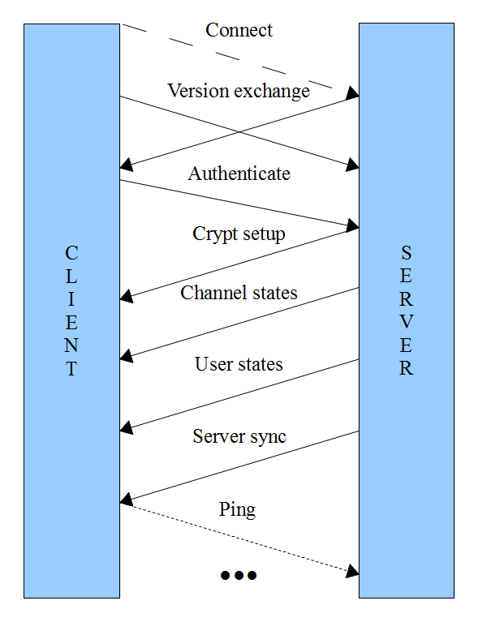

# Establishing a connection

This section describes the communication between the server and the client
during connection establishing, note that only the TCP connection needs
to be established for the client to be connected. After this the client
will be visible to the other clients on the server and able to send other
types of messages.

## Connect

As the basis for the synchronization procedure the client has to first
establish the TCP connection to the server and do a common TLSv1 handshake.
To be able to use the complete feature set of the Mumble protocol it is
recommended that the client provides a strong certificate to the server.
This however is not mandatory as you can connect to the server without
providing a certificate. However the server must provide the client with
its certificate and it is recommended that the client checks this.

## Version exchange

Once the TLS handshake is completed both sides should transmit their version
information using the Version message. The message structure is described below.

Note: This `Version` documentation is outdated. Please refer to the current proto definitions for up-to-date information.

| Field        | Type     |
| ------------ | -------- |
| `version`    | `uint32` |
| `release`    | `string` |
| `os`         | `string` |
| `os_version` | `string` |

The version field is a combination of major, minor and patch version numbers (e.g. 1.2.0)
so that major number takes two bytes and minor and patch numbers take one byte each.
The release, os and os_version
fields are common strings containing additional information.

| Major   | Minor  | Patch  |
| ------- | ------ | ------ |
| 2 bytes | 1 byte | 1 byte |

The version information may be used as part of the *SuggestConfig* checks, which usually
refer to the standard client versions. The major changes between these versions are listed
in table below. The *release*, *os* and *os_version* information is not interpreted in
any way at the moment.

| Version | Major changes                             |
| ------- | ----------------------------------------- |
| 1.2.0   | CELT 0.7.0 codec support                  |
| 1.2.2   | CELT 0.7.1 codec support                  |
| 1.2.3   | CELT 0.11.0 codec                         |
| 1.2.4   | Opus codec support, SuggestConfig message |

## Authenticate

Once the client has sent the version it should follow this with the Authenticate message.
The message structure is described in the figure below. This message may be sent immediately
after sending the version message. The client does not need to wait for the server version
message.

| Field      | Type     |
| ---------- | -------- |
| `username` | `string` |
| `password` | `string` |
| `tokens`   | `string` |

The username and password are UTF-8 encoded strings. While the client is free to accept any
username from the user the server is allowed to impose further restrictions. Furthermore
if the client certificate has been registered with the server the client is primarily
known with the username they had when the certificate was registered. For more
information see the server documentation.

The password must only be provided if the server is passworded, the client provided no
certificate but wants to authenticate to an account which has a password set, or to
access the SuperUser account.

The third field contains a list of zero or more token strings which act as passwords
that may give the client access to certain ACL groups without actually being a
registered member in them, again see the server documentation for more information.

## Crypto setup

Once the Version packets are exchanged the server will send a CryptSetup packet to
the client. It contains the necessary cryptographic information for the OCB-AES128
encryption used in the UDP Voice channel. The packet is described in figure
below. The encryption itself is described in a later section.

| Field          | Type  |
| -------------- | ----- |
| `key`          | bytes |
| `client_nonce` | bytes |
| `server_nonce` | bytes |

## Channel states

After the client has successfully authenticated the server starts listing the channels
by transmitting partial ChannelState message for every channel on this server. These
messages lack the channel link information as the client does not yet have full
picture of all the channels. Once the initial ChannelState has been transmitted
for all channels the server updates the linked channels by sending new packets for
these. The full structure of these ChannelState messages is shown below:

| Field          | Type              |
| -------------- | ----------------- |
| `channel_id`   | `uint32`          |
| `parent`       | `uint32`          |
| `name`         | `string`          |
| `links`        | repeated `uint32` |
| `description`  | `string`          |
| `links_add`    | repeated `uint32` |
| `links_remove` | repeated `uint32` |
| `temporary`    | optional `bool`   |
| `position`     | optional `int32`  |

*The server must send a ChannelState for the root channel identified with ID 0.*

## User states

After the channels have been synchronized the server continues by listing the
connected users. This is done by sending a UserState message for each user
currently on the server, including the user that is currently connecting.

| Field              | Type     |
| ------------------ | -------- |
| `session`          | `uint32` |
| `actor`            | `uint32` |
| `name`             | `string` |
| `user_id`          | `uint32` |
| `channel_id`       | `uint32` |
| `mute`             | `bool`   |
| `deaf`             | `bool`   |
| `suppress`         | `bool`   |
| `self_mute`        | `bool`   |
| `self_deaf`        | `bool`   |
| `texture`          | `bytes`  |
| `plugin_context`   | `bytes`  |
| `plugin_identity`  | `string` |
| `comment`          | `string` |
| `hash`             | `string` |
| `comment_hash`     | `bytes`  |
| `texture_hash`     | `bytes`  |
| `priority_speaker` | `bool`   |
| `recording`        | `bool`   |

## Server sync

The client has now received a copy of the parts of the server state it
needs to know about. To complete the synchronization the server transmits
a ServerSync message containing the session id of the clients session,
the maximum bandwidth allowed on this server, the servers welcome text
as well as the permissions the client has in the channel it ended up in.

For more information pease refer to the Mumble.proto file[^1].

## Ping

If the client wishes to maintain the connection to the server it is required
to ping the server. If the server does not receive a ping for 30 seconds it
will disconnect the client.

[^1]: <https://raw.github.com/mumble-voip/mumble/master/src/Mumble.proto>
