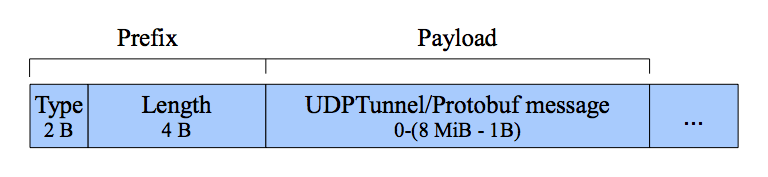

Protocol stack (TCP)
====================

Mumble has a shallow and easy to understand stack. Basically it
uses Google's Protocol Buffers [#f1]_ with simple prefixing to
distinguish the different kinds of packets sent through an TLSv1
encrypted connection. This makes the protocol very easily expandable.

.. _mumble-packet:

   Mumble packet

The prefix consists out of the two bytes defining the type of the packet
in the payload and 4 bytes stating the length of the payload in bytes
followed by the payload itself. The following packet types are available
in the current protocol and all but UDPTunnel are simple protobuf messages.
If not mentioned otherwise all fields outside the protobuf encoding are big-endian.

.. table:: Packet types

   +---------+------------------------+
   | Type    | Payload                |
   +=========+========================+
   | 0       | Version                |
   +---------+------------------------+
   | 1       | UDPTunnel              |
   +---------+------------------------+
   | 2       | Authenticate           |
   +---------+------------------------+
   | 3       | Ping                   |
   +---------+------------------------+
   | 4       | Reject                 |
   +---------+------------------------+
   | 5       | ServerSync             |
   +---------+------------------------+
   | 6       | ChannelRemove          |
   +---------+------------------------+
   | 7       | ChannelState           |
   +---------+------------------------+
   | 8       | UserRemove             |
   +---------+------------------------+
   | 9       | UserState              |
   +---------+------------------------+
   | 10      | BanList                |
   +---------+------------------------+
   | 11      | TextMessage            |
   +---------+------------------------+
   | 12      | PermissionDenied       |
   +---------+------------------------+
   | 13      | ACL                    |
   +---------+------------------------+
   | 14      | QueryUsers             |
   +---------+------------------------+
   | 15      | CryptSetup             |
   +---------+------------------------+
   | 16      | ContextActionModify    |
   +---------+------------------------+
   | 17      | ContextAction          |
   +---------+------------------------+
   | 18      | UserList               |
   +---------+------------------------+
   | 19      | VoiceTarget            |
   +---------+------------------------+
   | 20      | PermissionQuery        |
   +---------+------------------------+
   | 21      | CodecVersion           |
   +---------+------------------------+
   | 22      | UserStats              |
   +---------+------------------------+
   | 23      | RequestBlob            |
   +---------+------------------------+
   | 24      | ServerConfig           |
   +---------+------------------------+
   | 25      | SuggestConfig          |
   +---------+------------------------+

For raw representation of each packet type see the attached Mumble.proto [#f2]_ file.

..      rubric:: Footnotes

.. [#f1] https://github.com/google/protobuf
.. [#f2] https://raw.github.com/mumble-voip/mumble/master/src/Mumble.proto
