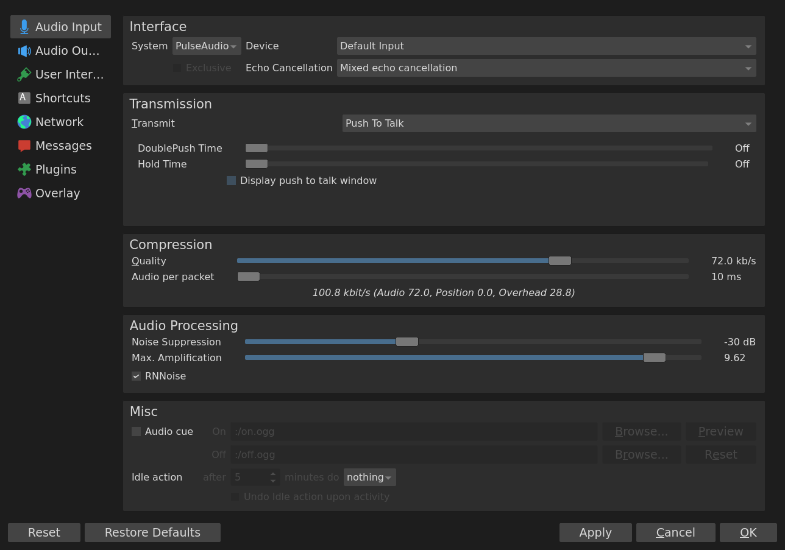
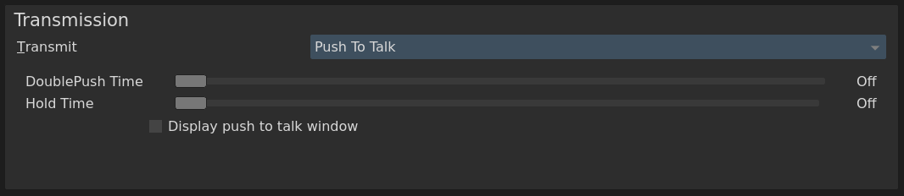
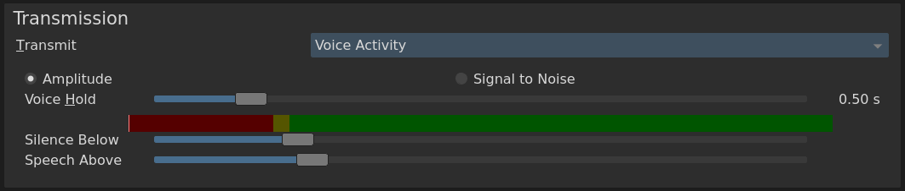
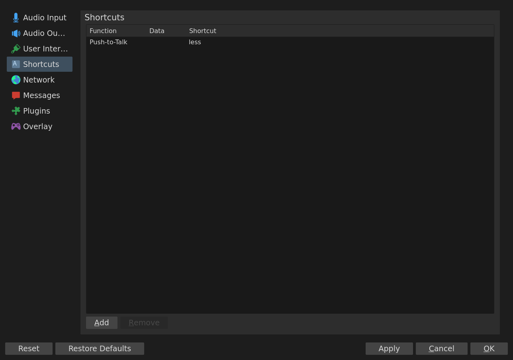
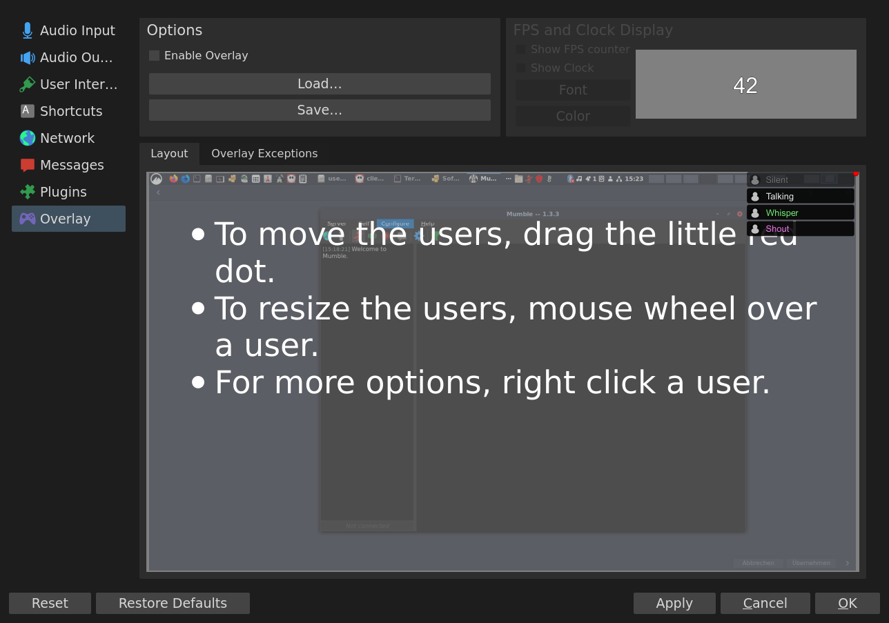

# Client Configuration Guide

**Note:** For Installation and Starting of the Mumble Client, see the specific [Userguides](README.md) for your Operating System.

<!-- Note: The pictures below are from a Mumble Client on Arch Linux, using the Dark Standard Theme, with already adjusted options. -->

<!-- Todo -->
<!--

- Add Troubleshooting section or seperate guide?

- Pictures or even Gifs could be added for better presentation
 

Here should be a picture

--->

<!--## Audio Wizard? -->

<!--## Important Config Options -->

<!-- 
Topics suggested by Krzmbrzl: 
- change theme between Lite and Dark mode, 
- (done) echo cancellation, 
- (almost done)transmission modes (VAD, PTT, continous),
- shortcuts 

-->

## Configuration Menu

Click on `Configure`->`Settings` or on the -symbol to open the Configuration Menu.

[Below](#most-important-options) you find a list with the most important options.

*Tip: A small description of each option is displayed, when you hover your mouse pointer over it.*

## Most important options

### Audio Input

#### Interface

##### Echo Cancellation

If enabled, this will filter echo from the audio you send to others.

You should usually enable it, because even when you use headsets, they might transmit undesired noise.

Choose one of the following options:

| Option: |	Description: | Usecases: |
| --- | --- | --- |
| Mixed echo cancellation | This is the basic Option: It will process all loudspeaker outputs bundled together. This is less accurate than the Multichannel option, but will also use less CPU. | Sufficient for setups with loudspeakers near to the microphone. |
| Multichannel echo cancellation | Extended option: This will process all audio channels seperately, this is more accurate, but will result in higher CPU usage. |	For setups with (multiple) loudspeakers farther away from the microphone. |
| Disabled | Disables echo cancellation (not recommended).  | - You use a very good headset.   - Or you use external echo cancellation (for example via pulseaudio on Linux).   - Echo cancellation is causing problems. |

#### Transmission

You can choose between three transmission modes:

1. **Push to Talk**

Your voice is only transmitted when you press a button.
You can set the button in the `Shortcuts`-Menu (see below).

2. **Voice Activity**

Your voice is only transmitted when a certain limit (loudness) is reached.
All noise below the limit will be canceled.

*Tip:* Use the `Audio Wizard`(`Configure`->`Audio Wizard`) to configure this option correctly.

<!-- what is the difference between `Amplitude` and `Signal to noise` ? -->

The coloured bar will show the noise-level when you speak, adjust `Silence below` (everything below the marker will not be transmitted) and `Speech above` (everything above the marker will be transmitted) accordingly.

3. **Continuous**

All Audio from your microphone will be transmitted continuously.

**Note:** You should usually **not** use this option, as it can be very annoying for listeners.
It is intended for special usecases (Music bots, Recording etc.) or when you use external tools for audio filtering instead.

#### Compression

| Option: | Description: |
| --- | --- |
| **Quality:** | Sets the maximum bandwidth the client will try to accomplish (it is limited by the Server you are connected to).
Setting it higher will increase the audio quality.
Only set it higher if your internet connection is good enough. <!-- maximum? --> |
| Audio per packet | <!-- What does it do? Which is option is better for which scenario? --> |

#### Audio Processing 

**RNNoise**

RNNoise is a noise suppression library.
It is intended to filter background noises from the audio that you send sent to other users.
RNNoise uses a deep learning algorithm so it should work better than most regular filters.

More information can be found on various websites:

- [RNNoise GitHub repo](https://github.com/xiph/rnnoise)
- [Article at Mozilla.org on RNNoise](https://hacks.mozilla.org/2017/09/rnnoise-deep-learning-noise-suppression/)

### Shortcuts

<!-- insert gif? -->

### Overlay

If enabled, it implements a small window inside other applications (mostly Games), that will show the users and their status in your Mumble channel.

In tab <!-- slider? --> `Layout` you can adjust the position of the window.

In tab `Overlay Exceptions` you can either specify a list of programs where the overlay is allowed (whitelist) or where the overlay is denied (blacklist).
<!-- whitelist and blacklist are considered problematic nowadays, use alternatives? -->