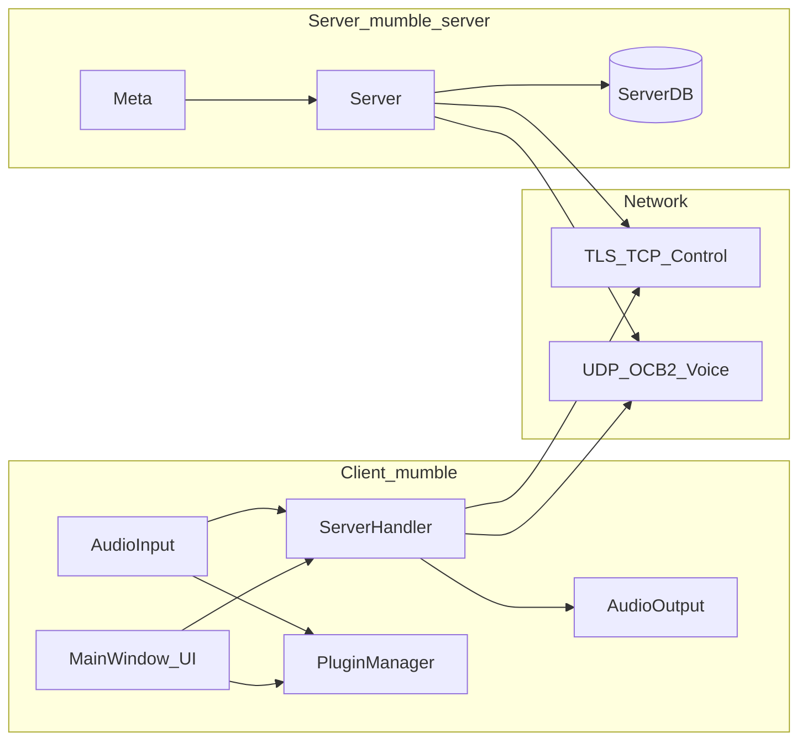
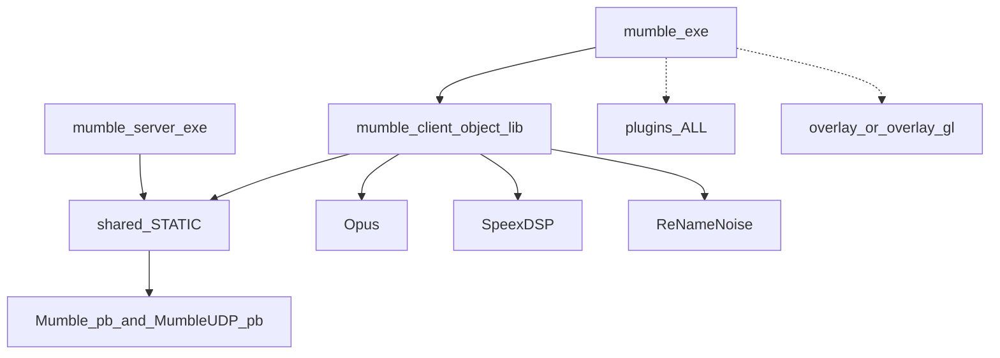
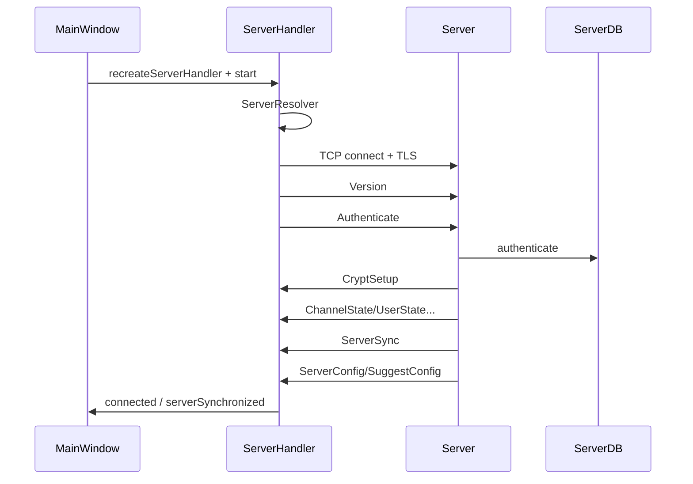

<!--
版本号: 1.1.0
修订日期: 2026-07-17
作者/生成者: Auto (Composer)
最后修订人: Auto (Composer)
变更说明:
  - 1.1.0 (2026-07-17): 增补「多群组收听」业务映射、Channel Listener 产品化（MultiGroupDialog / 状态栏范围提示）、服务端监听上限文案与 ini 推荐说明、回归清单。
  - 1.0.0 (2026-07-17): 初版。基于 Mumble 1.5.901 工作区源码与官方公开资料整理的中文技术文档，覆盖目录结构、模块组成、模块关系、核心流程，并扩展协议、音频、权限/持久化、扩展系统、构建 CI、安全与学习路径。
-->

# Mumble 1.5.901 技术文档

> **配套可视化导览**：可在 Cursor 中打开 Canvas  
> `C:\Users\bw\.cursor\projects\e-rd-mumble-mumble-1-5-901\canvases\mumble-architecture-guide.canvas.tsx`  
> Canvas 用于快速浏览架构与阅读路径；本文档为完整技术事实与细节的权威正文。

---

## 目录

1. [前言与版本约定](#1-前言与版本约定)
2. [项目定位与历史](#2-项目定位与历史)
3. [源码目录结构](#3-源码目录结构)
4. [模块组成](#4-模块组成)
5. [模块间关系](#5-模块间关系)
6. [核心流程与模块调用](#6-核心流程与模块调用)
7. [网络协议与加密](#7-网络协议与加密)
8. [音频与设备后端](#8-音频与设备后端)
9. [权限、数据与持久化](#9-权限数据与持久化)
10. [扩展系统](#10-扩展系统)
11. [构建、测试、CI 与打包](#11-构建测试ci-与打包)
12. [安全与运维要点](#12-安全与运维要点)
13. [术语表](#13-术语表)
14. [学习路径](#14-学习路径)
15. [参考链接](#15-参考链接)
16. [附录](#16-附录)

---

## 1. 前言与版本约定

### 1.1 文档目的

本文档面向**第一次接触 Mumble 源码**的开发者、架构学习者与二次开发者，目标是把「仓库里有什么、模块怎么拼、数据怎么流、从哪里读起」讲清楚。内容尽量详尽，并在关键断言处给出源码路径/符号，便于对照阅读。

### 1.2 文档基准与资料分层

| 层级 | 来源 | 在本文中的用法 |
|------|------|----------------|
| **A. 硬事实** | 当前工作区 `mumble-1.5.901` 源码、`docs/`、`*.proto`、CMake、`auxiliary_files/mumble-server.ini` | 架构、流程、协议、构建选项的主依据 |
| **B. 稳定线资料** | GitHub tag `v1.5.901` / 分支 `1.5.x` 配套文档 | 与本树一致时可直接引用 |
| **C. 产品/历史背景** | [mumble.info](https://www.mumble.info/)、官方 blog、Downloads | 定位、发行物、时间线、用户功能叙述 |
| **D. 未来线** | GitHub `master` | **不得**直接当作 1.5.901 源码事实；仅附录对照 |
| **E. 历史协议文** | master 上的 `docs/dev/network-protocol`（**本树不存在该目录**） | 自称针对约 1.2.x；连接模型可参考，消息格式以本树 `.proto` 为准 |

### 1.3 版本号语义

CMake 工程版本形如 `1.5.${BUILD_NUMBER}`（见根目录 `CMakeLists.txt`）。官方自 2021 年底起采用「第三段为构建号」的方案，因此**不存在 1.5.0**；1.5 系列首个稳定版为 **1.5.634**，本工作区目标为 **1.5.901**。

### 1.4 本工作区快照完整性（务必先读）

当前目录**不是完整可直接默认构建的 Git 工作副本**，写作与本地实验时需注意：

1. **无 `.git` 元数据**：无法用本目录直接核对提交、tag 或子模块状态。
2. **`.gitmodules` 声明了 11 个子模块**，但工作区中对应内容通常未检出，例如：`minhook`、`mach-override-src`、`speexdsp`、`FindPythonInterpreter`、`tracy`、`nlohmann_json`、`gsl`、`SPSCQueue`、`cmake-compiler-flags`、`renamenoise`、`flag-icons`。
3. 默认构建依赖上述子模块（如根 `CMakeLists.txt` 引用 `FindPythonInterpreter` / `cmake-compiler-flags`；`src/CMakeLists.txt` 使用 Tracy、GSL；客户端使用 JSON、ReNameNoise 等）。官方构建说明要求：`git submodule update --init --recursive`。
4. 官方源码导读 `docs/dev/TheMumbleSourceCode.md` 中的目录树部分条目已过时（如顶层 `man`、`g15helper`、`samples`、`screenshots`、`overlay_winx64`）；以本文第 3 章与当前树为准。

### 1.5 读者路径建议

| 目标 | 建议阅读顺序 |
|------|----------------|
| 快速建立心智模型 | §2 → §5 → Canvas → §6 时序图 |
| 改客户端 UI/连接 | §3.3 → §4.2 → §6.1–6.3 → `MainWindow` / `ServerHandler` |
| 改语音/音频 | §8 → §6.4 → `AudioInput` / `AudioOutput` / `Server::processMsg` |
| 改服务端/ACL/Ice | §4.3 → §6.5–6.7 → §9 → §10.2 |
| 写插件/位置音频 | §10.1 → `docs/dev/plugins/` |
| 本地编译 | §11 → `docs/dev/build-instructions/`（并先补齐子模块） |

---

## 2. 项目定位与历史

### 2.1 定位

Mumble 是开源、低延迟、高质量的语音聊天软件，客户端建立在 **Qt + Opus** 之上（见根 `README.md`）。仓库内两大可执行组件：

| 组件 | 可执行目标名 | 历史名 | 职责 |
|------|--------------|--------|------|
| 客户端 | `mumble`（macOS Bundle 名 `Mumble`） | — | GUI、采集/播放、连接、插件、Overlay |
| 服务端 | `mumble-server` | **Murmur** | 多虚拟服务器、ACL、语音路由、Ice/DBus 管理 |

源码目录仍大量使用 `murmur` 命名；产品文档中「Murmur」与「mumble-server」并存。

### 2.2 支持平台（产品表述 + 源码能力）

- **客户端**：Windows、Linux、FreeBSD、OpenBSD、macOS（README）。Windows 指 7+；Vista 不保证；XP 需回退 1.3.x。
- **服务端**：凡能安装 Qt 之处原则上可运行。
- **音频后端**：随平台 CMake 选项变化（WASAPI / PulseAudio / PipeWire / ALSA / CoreAudio / JACK / PortAudio / ASIO / OSS 等）。
- **Overlay**：Windows 独立 `overlay`；Unix/macOS 为 `overlay_gl`；Apple Silicon macOS 上 CMake 会强制关闭 overlay（`mach_override` 不支持 ARM）。
- **移动端**：官方 iOS 仓库长期未维护；无官方 Android（第三方如 Mumla）。属产品生态，不在本树实现范围内。

### 2.3 1.5 系列时间线（背景，来源：官方 blog / GitHub Releases）

| 版本 | 角色 | 备注 |
|------|------|------|
| 1.5.517 / 613 / 629 | RC | 预发布 |
| **1.5.634** | 首个稳定 1.5 | 2024-05-19 |
| 1.5.735 | 第二稳定 | |
| 1.5.857 | 第三稳定 | |
| **1.5.901** | 本树目标稳定版 | 公告约 2026-05-17 |

说明：个别文案称 1.5.901 为「third patch」，按 634→735→857→901 序列更宜称第四个稳定版——写作时以发布序列为准。

### 2.4 相对 1.4 的结构性变化（1.5.634 基线，1.5.901 继承）

以下内容来自官方 1.5.634 公告，并已在本树源码中体现：

1. **UDP 引入 Protobuf**（`MumbleUDP.proto`），与旧自定义二进制格式按协议版本兼容切换（`PROTOBUF_INTRODUCTION_VERSION = 1.5.0`）。
2. **语音编解码以 Opus 为主路径**；客户端正常路径强制 Opus。
3. **客户端设置改为 JSON**（`Settings` + nlohmann_json）。
4. **服务端移除 gRPC**；本树管理面为 **Ice**（可选）与 Unix **D-Bus**。
5. 通用插件框架（自 1.4）、持久化 Channel Listeners、无障碍改进、ReNameNoise 等。
6. 1.5.901 自身还包含若干安全与稳定性修复（见官方 blog changelog；具体 CVE 以安全通告为准）。

### 2.5 许可证与社区

- 许可证：BSD 风格（根目录 `LICENSE`）。
- 社区：Matrix `#mumble:matrix.org` / 开发频道 `#mumble-dev:matrix.org`；翻译 Weblate；安全联系见 `SECURITY.md`。

---

## 3. 源码目录结构

### 3.1 顶层目录树（本工作区实测职责）

```text
mumble-1.5.901/
├─ .ci/                      # Azure Pipelines 环境/构建/发布脚本
├─ .github/                  # GitHub Actions、Issue 模板、依赖安装 Action
├─ 3rdPartyLicenses/         # 第三方许可证文本（打包/关于界面用）
├─ 3rdparty/                 # 内嵌源码、SDK 头文件、*-build 适配、子模块路径
├─ auxiliary_files/          # man、desktop/AppStream、systemd、默认 ini、包装脚本
├─ cmake/                    # 编译器、平台、安装路径、Qt 工具、FindModules
├─ docs/                     # 开发者文档（用户手册主要在官网）
│  └─ zh/                    # （本中文技术文档所在目录）
├─ helpers/                  # G15 helper、自定义 Ice vcpkg port 等
├─ icons/                    # 应用图标
├─ installer/                # Windows WixSharp 安装器定义与许可证素材
├─ macx/                     # macOS OSAX overlay、发布脚本
├─ overlay/                  # Windows Overlay（注入、Hook、shader、overlay_exe）
├─ overlay_gl/               # Unix/macOS OpenGL/Vulkan Overlay 共享库
├─ plugins/                  # 内置位置音频等插件 + 插件 SDK 头文件
├─ scripts/                  # 代码生成、许可证、翻译、vcpkg、格式化等脚本
├─ src/                      # ★ 主源码
│  ├─ crypto/                # UDP 加密等
│  ├─ mumble/                # 客户端
│  ├─ murmur/                # 服务端
│  ├─ tests/                 # 单元测试
│  └─ benchmarks/            # 可选基准测试
├─ themes/                   # 内置主题（Default：Lite/Dark）
├─ CMakeLists.txt            # 根构建入口
└─ README.md
```

### 3.2 各目录职责详解

#### 3.2.1 `src/` — 共享源码与双端入口

直接位于 `src/` 下、被客户端与服务端共同使用的能力，主要通过静态库 **`shared`** 链接，包括：

- 协议：`Mumble.proto`、`MumbleUDP.proto`、`MumbleProtocol.*`、`ProtoUtils.*`
- 加密：`crypto/CryptState*.*`、`CryptographicHash`、`CryptographicRandom`
- TLS 辅助：`SSL.*`、`SSLLocks.*`、`FFDHE.*`、`SelfSignedCertificate.*`
- 网络地址：`HostAddress`、`ServerAddress`、`ServerResolver*`、`UnresolvedServerAddress`、`Net.h`
- 杂项：`Version`、`Timer`、`Ban`、`HTMLFilter`、`OSInfo`、`PlatformCheck`、`ProcessResolver` 等

另有一类「领域模型」源码（`ACL`、`Channel`、`Group`、`User`、`Connection`、`ChannelListenerManager`）**并不进入 `shared` 目标**，而是由 `src/mumble/CMakeLists.txt` 与 `src/murmur/CMakeLists.txt` **分别再次编译**（源码级共享），以便按 `MUMBLE` / `MURMUR` 宏做条件定制。

#### 3.2.2 `src/mumble/` — 客户端

| 文件 | 角色 |
|------|------|
| `main.cpp` | 进程入口；CLI、单实例、初始化次序、事件循环、有序关闭 |
| `MumbleApplication.*` | `QApplication` 子类；关机/URL 打开等 |
| `Global.*` | 进程级服务定位器（窗口、设置、连接、音频、插件…） |
| `MainWindow.*` + `.ui` | UI 中枢 + 大量业务协调；TCP 消息最终落到 `msgXxx` |
| `Messages.cpp` | **属于 MainWindow 的消息处理实现**（文件分离） |
| `ServerHandler.*` | 连接线程：DNS、TLS、UDP、ping、隧道切换 |
| `UserModel.*` | 频道/用户树内存模型与 Qt Model |
| `ClientUser.*` | 客户端侧用户扩展（本地音量、忽略、talking 状态等） |
| `Audio*.*` | 输入/输出抽象、混音、每用户语音缓冲 |
| `WASAPI`/`PulseAudio`/`PipeWire`/… | 平台音频后端 |
| `PluginManager.*` / `API_v_*.*` | 插件加载与 Mumble-API |
| `Overlay*.*` | Overlay 控制端 |
| `Settings.*` / `Database.*` | JSON 设置 + SQLite 持久化 |
| `GlobalShortcut*.*` | 全局快捷键 |
| `ConnectDialog.*` / `ConfigDialog.*` | 连接与设置 UI |

#### 3.2.3 `src/murmur/` — 服务端

| 文件 | 角色 |
|------|------|
| `main.cpp` | 入口；日志、daemon、DB、Meta、Ice/DBus、bootAll |
| `Meta.*` | 全局配置 `MetaParams`、虚拟服务器生命周期、全局自动封禁 |
| `Server.*` | 单虚拟服务器：TCP/UDP、主逻辑、**语音线程** |
| `Messages.cpp` | `Server::msgXxx` 协议处理 |
| `ServerDB.*` | 数据库访问与迁移（结构版本 9） |
| `ServerUser.*` | 连接+用户+带宽/限流/Whisper 缓存 |
| `AudioReceiverBuffer.*` | 语音接收者分组与包复用 |
| `MumbleServer.ice` + `MumbleServerIce.*` | Ice RPC |
| `DBus.*` | Unix D-Bus 管理面 |
| `UnixMurmur.*` | Unix 能力、信号、ini 搜索 |
| `RPC.cpp` | 认证器/监听器连接辅助 |
| `Register.cpp` / `Zeroconf.*` | 公网列表注册 / mDNS |

#### 3.2.4 Overlay / 插件 / 主题 / 辅助

- **`overlay/`**：Windows 注入库、D3D/OpenGL hooks、FXC shader 生成、`overlay_exe` helper。
- **`overlay_gl/`**：Linux/macOS 共享库；可选 32-bit 交叉构建。
- **`macx/osax/`**：macOS Overlay 辅助组件。
- **`plugins/`**：内置游戏位置音频插件 + `MumblePlugin.h` 等 SDK。
- **`themes/Default/`**：Lite/Dark；经 `DefaultTheme.qrc` 打入客户端。
- **`auxiliary_files/`**：`mumble-server.ini` 模板、man pages、systemd unit、desktop/AppStream、`mumble-overlay` 包装脚本。
- **`installer/`**：WixSharp（`MumbleInstall.cs`、`ClientInstaller.cs`、`ServerInstaller.cs`）。
- **`scripts/`**：`generate-ffdhe.py`、`generate_license_header.py`、`generateIceWrapper.py`、`generate_flag_qrc.py` 等。

#### 3.2.5 构建与 CI

- **`cmake/`**：`compiler.cmake`、`os.cmake`、`install-paths.cmake`、`qt-utils.cmake`、Find modules。
- **`.github/workflows/`**：`build.yml`、`pr-checks.yml`、`code-ql.yml`、backport、winget 等。
- **`.ci/azure-pipelines/`**：跨平台构建与发布任务。
- **`.cirrus.yml`**：FreeBSD。
- **`.appveyor.yml`**：Windows 静态构建/签名相关。

### 3.3 关键入口文件速查

| 用途 | 路径 |
|------|------|
| 根构建 | `CMakeLists.txt` |
| 共享库与 proto 生成 | `src/CMakeLists.txt` |
| 客户端构建 | `src/mumble/CMakeLists.txt` |
| 服务端构建 | `src/murmur/CMakeLists.txt` |
| 客户端 `main` | `src/mumble/main.cpp`（约 L135） |
| 服务端 `main` | `src/murmur/main.cpp`（约 L203） |
| TCP proto | `src/Mumble.proto` |
| UDP proto | `src/MumbleUDP.proto` |
| TCP/UDP 类型宏 | `src/MumbleProtocol.h` |
| Ice IDL | `src/murmur/MumbleServer.ice` |
| 默认服务端配置 | `auxiliary_files/mumble-server.ini` |
| 源码导读（英文） | `docs/dev/TheMumbleSourceCode.md` |
| 服务端锁约定 | `docs/dev/MurmurLocking.md` |
| 构建说明入口 | `docs/dev/build-instructions/README.md` |
| 插件文档入口 | `docs/dev/plugins/README.md` |

### 3.4 命名与实现分离的注意点

Mumble 中**头文件名不等于实现必然同名**：例如 `MainWindow` 与 `Server` 的大量方法实现分散在 `Messages.cpp`。追踪功能时应用符号搜索，而不是只打开同名 `.cpp`。

### 3.5 `3rdparty` 与子模块清单

`.gitmodules` 声明的子模块：

| 路径 | 用途概要 |
|------|----------|
| `3rdparty/minhook` | Windows Overlay hook |
| `3rdparty/mach-override-src` | macOS Overlay hook |
| `3rdparty/speexdsp` | 重采样/AEC/预处理/抖动缓冲 |
| `3rdparty/FindPythonInterpreter` | CMake 找 Python |
| `3rdparty/tracy` | 性能分析 |
| `3rdparty/nlohmann_json` | 设置 JSON |
| `3rdparty/gsl` | Microsoft GSL |
| `3rdparty/SPSCQueue` | Windows 客户端无锁队列 |
| `3rdparty/cmake-compiler-flags` | 编译器 flags 辅助 |
| `3rdparty/renamenoise` | 神经网络降噪 |
| `3rdparty/flag-icons` | 国旗图标资源 |

此外还有非 submodule 的内嵌/头文件树：如 `qqbonjour`、`smallft`、`arc4random`、`pipewire`/`pulseaudio`/`jack`/`portaudio` 兼容头、`GL` 等。

---

## 4. 模块组成

### 4.1 分层总览

```text
L6 应用层     MainWindow / Meta+Server / UI / 管理 RPC
L5 状态与扩展  Settings/DB / Plugin / Overlay / Zeroconf
L4 媒体路由    AudioInput/Output（客户端）; processMsg 转发（服务端不解码 Opus）
L3 传输协议    Connection(TLS帧) + UDP(OCB2) + MumbleProtocol 编解码
L2 领域模型    User/Channel/Group/ACL/ChannelListener（源码级共享）
L1 公共库      shared（协议工具、加密、地址、SSL 辅助…）
L0 依赖与 OS   Qt5 / OpenSSL / Protobuf / Opus / SpeexDSP / Ice / 平台音频 API
```

### 4.2 客户端模块清单

#### 4.2.1 进程与全局状态

- **`MumbleApplication`**：应用对象、系统事件。
- **`Global`**：几乎所有子系统指针与会话态（`mw`、`sh`、`ai`/`ao`、`s`、`db`、`pluginManager`、`uiSession`、`iTarget`、服务端限制字段、`ChannelListenerManager` 等）。访问入口：`Global::get()`。
- **`DeferInit`**：静态优先级初始化/销毁注册。
- **`Settings`**：庞大配置结构 + JSON 原子保存（临时文件 → backup → rename）。
- **`Database`**：SQLite；收藏服务器、密码、证书摘要、token、本地静音/音量、blob 等。**约定仅主线程访问**（见 `Global.h` 注释）。

#### 4.2.2 UI 与模型

- **`MainWindow`**：菜单/托盘/聊天/连接/重连/证书对话框；接收网络线程投递的 TCP 事件并分派。
- **`UserModel` / `UserView`**：树形展示频道、用户、Listener 代理。
- **`TalkingUI`**：独立说话者窗口。
- **`ConfigDialog` + `ConfigWidget` 注册表**：音频、外观、网络、插件、Overlay、快捷键等设置页。
- **`Log` / TTS**：日志、通知、可选语音合成。

#### 4.2.3 网络

- **`ServerHandler`（`QThread`）**：解析主机、建立 `QSslSocket`、`Connection`、UDP socket、ping、Crypt 状态、向 `MainWindow` 投递控制消息、向 `AudioOutput` 投递语音。
- **`Connection`**：TLS 上的 2+4 字节帧协议。
- **`ServerResolver`**：`_mumble._tcp` SRV + A/AAAA。
- **`SocketRPC` / DBus**：本机二次启动控制与部分桌面集成。

#### 4.2.4 音频

- **`Audio`**：启停输入输出、连接插件音频回调。
- **`AudioInputRegistrar` / `AudioOutputRegistrar`**：后端工厂注册表。
- **`AudioInput`**：48 kHz、10 ms 帧；重采样、AEC、降噪、VAD/PTT、Opus、UDP 编码、发送。
- **`AudioOutput` / `AudioOutputSpeech`**：每用户抖动缓冲、Opus 解码/PLC、定位混音、优先级发言衰减。
- **平台后端**：WASAPI、ASIO、CoreAudio、ALSA、Pulse、PipeWire、JACK、OSS、PortAudio。

#### 4.2.5 插件与 Overlay

- **`Plugin` / `PluginManager` / `LegacyPlugin`**：扫描动态库，新 API 优先。
- **`MumbleAPI`（`API_v_1_x_x.cpp`）**：插件→客户端；跨线程 marshal 到 GUI 主线程。
- **`Overlay` / `OverlayClient`**：本地 pipe/socket + 共享内存像素；平台注入在 `overlay*`。

#### 4.2.6 其它客户端能力

- 全局快捷键引擎与平台实现。
- `VoiceRecorder` 录音。
- `VersionCheck` / `WebFetch` 更新检查。
- `Cert` 客户端证书管理。
- `Themes` / 翻译 `.ts`。

### 4.3 服务端模块清单

#### 4.3.1 进程与多虚拟服务器

- **`Meta` / `MetaParams`**：全局 INI、证书默认、Ice/DBus 参数、`bootAll`/`killAll`、连接失败自动封禁内存表。
- **`Server`**：一个虚拟服务器实例；同时是 `QThread`（语音线程）。
- **端口惯例**：默认 `Meta::mp.usPort + server_id - 1`（常见默认基端口 **64738**）。

#### 4.3.2 协议、用户与权限

- **`Messages.cpp`**：认证、状态同步、ACL、文本、Ban、VoiceTarget、CryptSetup、插件数据等。
- **`ServerUser`**：继承 `Connection` + `User`；UDP 端点、CryptState、带宽记录、LeakyBucket、Whisper 缓存。
- **`ACL` / `Group` / `Channel`**：权限计算与频道树。
- **`ChannelListenerManager`**：跨频道监听及音量调整（可持久化）。

#### 4.3.3 语音路由

- **`Server::run`**：高优先级 UDP poll 循环。
- **`Server::processMsg`**：认证/静音/带宽检查 → 普通/链接/Listener/Whisper 展开 → 转发。
- **`AudioReceiverBuffer`**：按协议版本、context、位置、音量调整分组，复用编码结果。
- **服务端不解码 Opus 载荷**，只解析头部并转发。

#### 4.3.4 持久化与管理面

- **`ServerDB`**：SQLite / PostgreSQL / MySQL(MariaDB) / ODBC；`DB_STRUCTURE_VERSION = 9`。
- **Ice**：`MumbleServer.ice`；生成 wrapper 把调用投递回 Qt 主线程。
- **DBus**：Unix 非 macOS 可选。
- **Zeroconf / Register**：局域网发现与公网服务器列表注册。

### 4.4 公共基础设施模块

| 模块 | 说明 |
|------|------|
| `MumbleProtocol` | TCP 类型枚举、UDP Audio/Ping 编解码、新旧格式切换 |
| `CryptStateOCB2` | AES-128 + OCB2；UDP 每包约 4 字节开销 |
| `Connection` | TLS 帧读写、与 CryptState 关联 |
| `HostAddress` / `ServerAddress` | 统一地址表示 |
| `FFDHE` | 可定制 DH 参数表（脚本生成） |
| Tracy（可选） | 性能分析；默认链接但需 CMake `tracy` 开启 |

### 4.5 测试与基准模块

`src/tests` 使用 Qt Test，覆盖协议、加密、PacketDataStream、版本、设置 JSON、证书、地址解析等。`src/benchmarks` 可选（Google Benchmark via FetchContent）。

---

## 5. 模块间关系

### 5.1 运行时双通道关系



要点：

1. **TCP/TLS 必需**：版本协商、认证、频道/用户状态、ACL、文本、CryptSetup、配置建议等。
2. **UDP 优选**：加密语音与 UDP ping；失败时可把同样的语音二进制封进 TCP 的 `UDPTunnel`。
3. **插件**可影响位置元数据、PCM、以及 `PluginDataTransmission` 控制消息。
4. **Ice/DBus** 旁路客户端协议，直接管理 Meta/Server（仍应回到主线程执行）。

### 5.2 构建目标依赖关系



更细的依赖边：

- `shared` ← Qt5 Core/Network/Xml、OpenSSL、Protobuf、Tracy、GSL。
- `mumble` ← object lib ← Qt Widgets/Sql/Svg/Concurrent、Poco Zip、libsndfile、平台库。
- `mumble-server` ← Qt Sql（Windows 另链 Widgets 做托盘）、可选 Ice/IceSSL、DBus、Zeroconf。
- Windows packaging 时 POST_BUILD 调用 WixSharp（`cscs.exe`）。

### 5.3 线程边界关系

#### 客户端

| 线程 | 拥有/负责 |
|------|-----------|
| GUI 主线程 | MainWindow、UserModel、Settings、主 Database、多数插件管理定时器、Overlay scene、MumbleAPI 实际执行 |
| `ServerHandler` | DNS、TLS/TCP、UDP socket、加解密、ping、语音收包后交给 AudioOutput；控制消息 `postEvent` 到 GUI |
| `AudioInput` | 采集、DSP、编码、调用 `ServerHandler::sendMessage` |
| `AudioOutput` | 解码、混音、播放 |
| 快捷键线程 | 平台按键采集 → 触发动作（可能写音频活动状态） |
| 其它 | VoiceRecorder；VersionCheck 的 `QtConcurrent`；部分音频后端回调线程 |

#### 服务端

| 线程 | 拥有/负责 |
|------|-----------|
| Qt 主线程 | TLS/TCP、状态写入、DB、Ice 最终执行、DBus、Meta |
| 每虚拟服务器 `Server` 语音线程 | UDP poll、解密、`processMsg`、加密发送；读共享状态时持 `qrwlVoiceThread` |

完整契约见 `Server.h` 注释与 `docs/dev/MurmurLocking.md`：**主线程写、语音线程读（加锁）**；少数路径（如 Whisper 缓存重建）会升级写锁。

### 5.4 客户端内部调用关系（简化）

```text
main
 ├─ Global / Settings / Database / PluginManager / Overlay
 ├─ MainWindow + UserModel
 ├─ Audio::start → AudioInput/Output registrars
 └─ QEventLoop

MainWindow.recreateServerHandler
 └─ ServerHandler thread
      ├─ ServerResolver
      ├─ QSslSocket + Connection
      ├─ TCP Protobuf → postEvent(MainWindow) → Messages.cpp msg*
      └─ UDP Audio → AudioOutput

AudioInput → Opus → UDP encode → ServerHandler::sendMessage
PluginManager ←→ Audio* / MainWindow / ServerHandler（信号与 API）
```

### 5.5 服务端内部调用关系（简化）

```text
main
 ├─ MetaParams::read(ini)
 ├─ ServerDB
 ├─ Meta
 ├─ IceStart / DBus
 └─ Meta::bootAll → new Server(id)
      ├─ listen TCP/UDP、读频道/封禁、证书
      └─ 用户认证成功后 start 语音线程

TCP: QSslSocket → Connection::socketRead → Server::message → msgXxx
UDP: Server::run → decrypt → decode → processMsg → sendMessage
Ice wrapper → ExecEvent → 主线程 Meta/Server 方法
```

### 5.6 配置与数据流关系

```text
客户端:
  Settings JSON  ←→  UI Config*
  Database SQLite ←→  收藏/密码/摘要/本地覆盖
  运行时 Global 字段 ← ServerConfig/ServerSync/PermissionQuery

服务端:
  内置默认 ← mumble-server.ini/murmur.ini ← 每虚拟服务器 DB config 覆盖
  频道/用户/ACL/ban/listener ←→ ServerDB
  内存 qhUsers / qhChannels ←→ 协议消息与语音路由
```

---

## 6. 核心流程与模块调用

### 6.1 客户端启动流程

入口：`src/mumble/main.cpp` → `main()`。

典型阶段（顺序有意义）：

1. 平台早期初始化（Windows DLL 搜索路径等）。
2. 创建 `MumbleApplication`，组织名/应用名、高 DPI、事件过滤。
3. `MumbleSSL::initialize`。
4. 解析 `--config` 并构造 `Global`。
5. 解析其余 CLI（URL、语言、RPC、多开、Jack 名、调试开关等）。
6. 单实例：DBus/SocketRPC 转发 URL 或激活已有窗口；Windows 锁文件。
7. `Settings::load`；必要时迁移 DB/插件路径并立即 `save`。
8. 主题、翻译、静态 `DeferInit`。
9. `QNetworkAccessManager`、`Database`、Zeroconf、`PluginManager::rescanPlugins`、Overlay、LCD。
10. 创建并显示 `MainWindow`、`TalkingUI`，连接 Listener 相关信号。
11. 创建 `Log`（依赖 MainWindow 已存在）。
12. SocketRPC/DBus；**`Audio::start()`**。
13. 首次音频向导、证书向导。
14. 版本检查、插件更新检查。
15. 处理启动 URL，否则弹出 `ConnectDialog`。
16. `a.exec()` 进入事件循环。

关闭顺序（同样关键，见 `main.cpp` 后半）：

1. 断开并等待 `ServerHandler`（期间继续泵事件，避免插件回调死锁）。
2. 停止音频。
3. 删除窗口后再释放 ServerHandler。
4. 释放网络、DB、日志、插件、Overlay、`Global`。
5. 特殊退出码可触发完整进程重启。

### 6.2 连接、认证与初始同步



客户端关键步骤：

1. `MainWindow` 经连接对话框或 `mumble://` URL 调用 `recreateServerHandler()`。
2. `ServerHandler::run`：解析地址列表并依次尝试。
3. 装入客户端证书，`startClientEncryption`，`encrypted` 后发送 `Version` 与 `Authenticate(username, password, tokens, opus=true)`。
4. 绑定 UDP；`emit connected()`。
5. 收齐状态后 `ServerSync`：设置 `Global::uiSession`、带宽、欢迎文本等，并 `serverSynchronized`。

服务端 `msgAuthenticate`（`src/murmur/Messages.cpp`）关键步骤：

1. 分配 session，加入用户表。
2. `Server::authenticate`（外部认证器优先，可回落 DB；`forceExternalAuth` 可 fail-closed）。
3. 校验重名、容量、`certrequired` 等。
4. 选择频道（最后所在 / 默认 / root）并检查 Enter。
5. **启动语音线程**。
6. 踢掉同账号旧连接；下发 `CryptSetup`；协商 codec。
7. 推送频道树、用户、Listener、`ServerSync`、`ServerConfig`、`SuggestConfig`。
8. `userConnected` 信号（供 Ice 回调等）。

证书错误：客户端可系统校验 / 比对已存摘要 / UI 询问是否信任；服务端对部分证书问题允许继续但标记非 strong（影响邮箱匹配等）。

### 6.3 TCP 控制消息分派链

**服务端：**

```text
QSslSocket::readyRead
 → Connection::socketRead   # uint16 type + uint32 len + payload
 → Connection::message
 → Server::message          # ParseFromArray + msg<Type>
 → Server::msgXxx           # Messages.cpp
```

**客户端：**

```text
Connection::message
 → ServerHandler::message
 → Ping / UDPTunnel 在网络线程处理
 → 其它：postEvent(MainWindow)
 → MainWindow::customEvent  # X-macro 建 protobuf
 → MainWindow::msgXxx       # Messages.cpp
```

TCP 帧上限约 `0x7fffff`；超限断连。

### 6.4 端到端语音流程

#### 6.4.1 发送端（客户端 A）

```text
设备后端 PCM
 → AudioInput::addMic (+ addEcho 参考)
 → 混音/重采样到 48 kHz
 → 10 ms / 480 sample 帧
 → Speex AEC → ReNameNoise/Speex 降噪 → AGC/VAD
 → PTT/Continuous/VAD/mute 裁决
 → opus_encode
 → 填充 AudioData（target、frameNumber、terminator、可选 position）
 → UDPAudioEncoder
 → ServerHandler::sendMessage
      ├─ OCB2 加密 + UDP datagram
      └─ 或 TCP UDPTunnel
```

仅 Opus：`AudioInput::selectCodec` 断言 Opus；服务端若要求非 Opus，客户端会断开。

#### 6.4.2 服务端路由

```text
Server::run (语音线程)
 → recv UDP → 找 ServerUser
 → CryptStateOCB2::decrypt
 → UDPDecoder::decode
 → processMsg(AudioData)
      ├─ 检查认证 / mute / suppress / 带宽
      ├─ target=0: 本频道 + Listener + 链接频道(需 Speak)
      ├─ target=1..30: VoiceTarget whisper/shout 缓存
      └─ target=31: server loopback
 → AudioReceiverBuffer 分组
 → 更新包可变段并 sendMessage（UDP 或 tcpTransmit）
```

服务端**不解码 Opus**，只做策略与转发；这是低延迟的关键设计点。

#### 6.4.3 接收端（客户端 B）

```text
ServerHandler::udpReady
 → decrypt → decode
 → handleVoicePacket
 → AudioOutput::addFrameToBuffer
 → AudioOutputSpeech (jitter + Opus decode/PLC)
 → AudioOutput::mix（本地音量、Listener、优先级衰减、位置音）
 → 可选插件修改最终 PCM
 → 设备播放
```

### 6.5 UDP ↔ TCP 隧道切换

- 客户端根据双向 UDP 统计，在 UDP 与 TCP tunnel 间切换（`ServerHandler`）。
- 发送路径：`bUdp` 为假或 force 时走 `UDPTunnel`。
- 服务端语音线程若无法 UDP 发送，则把报文投递主线程走 TCP。
- `UDPTunnel` 在服务端 `Server::message` 中按「裸 UDP payload」解码，而不是当作普通 protobuf 消息字段解析；因此名为 `msgUDPTunnel` 的常规 handler 实际上不可达（实现细节/历史痕迹）。

### 6.6 文本消息流程

```text
Chatbar
 → MainWindow::sendChatbarText
 → Markdown→HTML 或纯文本转义
 → ServerHandler::sendChannelTextMessage / sendUserTextMessage
 → TCP TextMessage
 → Server::msgTextMessage（权限、长度、HTML/图片检查、可选 filter 信号）
 → 广播给目标用户
 → 客户端 Messages.cpp 接收 → Log / TTS（尊重本地 ignore）
```

### 6.7 ACL 变更与权限查询

1. 客户端编辑器或管理操作发送 `ACL` / `PermissionQuery` 等消息。
2. 服务端检查操作者权限，更新内存 Group/ACL，清缓存，防把自己锁死，持久化，刷新相关用户权限。
3. 有效权限由 `ChanACL::effectivePermissions` 自 root 向下计算；SuperUser 几乎全权限但不自动获得 Speak/Whisper；默认权限含 Traverse/Enter/Speak/Whisper/TextMessage/Listen。

### 6.8 Channel Listener、多群组收听与 Whisper

- **Listener**：用户可监听其它频道语音；客户端 TalkingUI/混音处理代理条目；服务端路由纳入 listener 集合；DB 表 `channel_listeners` 可持久化。
- **业务「多群组」映射**（不改物理多成员）：
  - 「加入多个群组」= 对多个 channel 建立 Listener（`listening_channel_add`）。
  - 「当前群组 / 进入」= 唯一的 `User::cChannel`；**本人 PTT 只发往该频道**。
  - 他人在任一已加入（监听）群组 PTT → 本人可听到（`Server::processMsg` → `getListenersForChannel`）。
  - 切换主频道**默认不清理**监听列表。
- **客户端入口**：
  - 菜单 **Self → Multi-Group Listening...**（`MultiGroupDialog`）。
  - 频道右键 **Listen To Channel** / 全局快捷键 Listen。
  - 状态栏：`Speak → <当前频道> · Listen → <监听列表>`（`MainWindow::updateVoiceScopeStatus`）。
- **运维配置**：`listenersperchannel` / `listenersperuser`（默认 `-1` 无上限）；详见 `auxiliary_files/mumble-server.ini` 与 [`多群组收听-验收与产品映射.md`](多群组收听-验收与产品映射.md)。
- **Whisper/Shout**：客户端通过 `VoiceTarget` 注册目标；服务端构建 `WhisperTargetCache`；ACL 变更等会清缓存防悬空。

### 6.9 插件数据传输

```text
Plugin → MumbleAPI → ServerHandler 发 PluginDataTransmission
 → Server 速率限制与长度校验 → 转发给目标 session
 → 对端 MainWindow::msgPluginDataTransmission → PluginManager
```

### 6.10 服务端 boot 与关闭

**Boot：**

```text
main → MetaParams::read → ServerDB → Meta
 → Ice/DBus → Meta::bootAll
 → 对每个未 boot=false 的 server_id: Meta::boot → new Server
```

Unix 注意：SQLite 必须在 daemon `fork` **之后**打开，否则子进程关闭继承 fd 会释放 POSIX 锁（`main.cpp` 注释详述）。

**Shutdown：**

信号 → quit 事件循环 → `cleanup`：`Meta::killAll` → 拆 DBus → `IceStop` → 关日志 → 删 Meta/pidfile。单个 `Server` 析构会停语音线程并等待。

### 6.11 客户端本地回环调试

`Settings::lmLoopMode`：

- **Local**：编码后不发送，注入本地 `LoopUser` 播放。
- **Server**：`target=31` 服务端 loopback。

用于排障而不依赖第二客户端。

---


## 7. 网络协议与加密

### 7.1 权威来源（本树）

| 构件 | 路径 | 说明 |
|------|------|------|
| TCP Protobuf | `src/Mumble.proto` | 控制面消息字段 |
| UDP Protobuf | `src/MumbleUDP.proto` | 1.5+ Audio/Ping |
| 类型与编解码 | `src/MumbleProtocol.h` / `.cpp` | X-macro、新旧 UDP、AudioData |
| TCP 帧 | `src/Connection.cpp` | 2 字节类型 + 4 字节长度 + payload |
| UDP 加密 | `src/crypto/CryptStateOCB2.*` | OCB2 |
| 默认端口 | `src/Net.h` | 常见默认 **64738** |

> 历史文档（master `network-protocol`）描述的 TLS 套件等细节**不要**直接当作 1.5.901 保证；以本树 OpenSSL/Qt 实际协商为准。

### 7.2 TCP 消息类型（27 类，编号不可重排）

定义于 `MumbleProtocol.h` 的 `MUMBLE_ALL_TCP_MESSAGES`：

| ID | 名称 | 典型用途 |
|----|------|----------|
| 0 | Version | 版本与发布字符串 |
| 1 | UDPTunnel | 语音包走 TCP 隧道 |
| 2 | Authenticate | 用户名/密码/tokens/opus 声明 |
| 3 | Ping | TCP ping 与加密统计 |
| 4 | Reject | 认证拒绝原因 |
| 5 | ServerSync | 会话建立完成、session、带宽、欢迎语 |
| 6 | ChannelRemove | 删频道 |
| 7 | ChannelState | 频道创建/更新/链接 |
| 8 | UserRemove | 用户离开/踢出 |
| 9 | UserState | 用户属性、频道、静音、插件 context/identity 等 |
| 10 | BanList | 封禁列表 |
| 11 | TextMessage | 文本 |
| 12 | PermissionDenied | 权限拒绝 |
| 13 | ACL | 查询/设置 ACL 与组 |
| 14 | QueryUsers | 查询注册用户 |
| 15 | CryptSetup | UDP 密钥与 nonce / 重同步 |
| 16 | ContextActionModify | 上下文菜单项增删 |
| 17 | ContextAction | 触发上下文动作 |
| 18 | UserList | 注册用户列表管理 |
| 19 | VoiceTarget | Whisper/Shout 目标 |
| 20 | PermissionQuery | 权限查询/刷新 |
| 21 | CodecVersion | Codec 协商（历史 CELT 字段仍可能出现） |
| 22 | UserStats | 用户统计 |
| 23 | RequestBlob | 拉取头像/评论等大对象 |
| 24 | ServerConfig | 服务器限制（消息长度、HTML、录音等） |
| 25 | SuggestConfig | 建议客户端配置 |
| 26 | PluginDataTransmission | 插件间/跨客户端数据 |

**警告（源码注释）**：只能在末尾追加新类型，禁止插入或删除已有编号。

### 7.3 TCP 线格式

```text
offset 0: uint16_be message_type
offset 2: uint32_be payload_length
offset 6: protobuf payload (payload_length bytes)
```

- 实现：`Connection::socketRead` / `Connection::messageToNetwork`
- 单帧 payload 上限约 `0x7fffff`；超过则断开

### 7.4 UDP 消息

`MUMBLE_ALL_UDP_MESSAGES`：

| ID | 名称 |
|----|------|
| 0 | Audio |
| 1 | Ping |

最大 UDP 包：`MAX_UDP_PACKET_SIZE = 1024`（`MumbleProtocol.h`）。

#### 7.4.1 协议版本切换

- `PROTOBUF_INTRODUCTION_VERSION = 1.5.0`
- 对端版本 `< 1.5.0`：旧紧凑二进制（首字节含 codec/type 与 target 等）
- 对端版本 `>= 1.5.0`：首字节为 `UDPMessageType`，其后 Proto3

服务端对新格式采用「固定段 + 可变段」部分编码，以便按接收者差异（context、音量调整等）复用大部分序列化结果。

#### 7.4.2 AudioData 逻辑字段

`Mumble::Protocol::AudioData`（`MumbleProtocol.h`）包括：

- target / context（普通说话、shout、whisper、listen 等）
- codec
- sender session
- frame number
- payload（Opus）
- terminator
- 可选 3D position
- 服务端 volume adjustment

保留 target：

- `0`：普通频道语音
- `31`：服务器 loopback
- `1..30`：VoiceTarget 槽位

### 7.5 加密模型

```text
控制面:  TLS（QSslSocket）保护所有 TCP 消息，包括 CryptSetup
语音面:  会话级对称密钥 + CryptStateOCB2（非 DTLS）
```

密钥建立：

1. TLS 握手完成并完成认证流程中的关键步骤。
2. 服务端生成 UDP key 与双向 nonce。
3. 经 TLS 内 `CryptSetup` 下发。
4. 客户端安装到 `Connection`/`CryptState`。
5. 解密长期失败时双方可触发 nonce 重同步（再走 `CryptSetup`）。

实现要点：

- `CryptStateOCB2`：AES-128 ECB 原语支撑 OCB2；每包约 4 字节开销；含重放/乱序窗口统计（good/late/lost/resync）。
- Ping 报文会携带这些计数，便于诊断。

### 7.6 地址解析与服务发现

1. **显式 host:port** 或 URL。
2. **`ServerResolver`**：查询 `_mumble._tcp.<hostname>` SRV，再解析 target；无 SRV 则直接解析主机名。
3. **Zeroconf/Bonjour/Avahi**：局域网浏览/发布（`qqbonjour` 适配层）。
4. **公网列表注册**：服务端 `Register.cpp`（可选）。

### 7.7 兼容与演进建议

- 扩展 TCP：更新 proto + `MUMBLE_ALL_TCP_MESSAGES` + 两端 `msgXxx`。
- 扩展 UDP：同时考虑旧格式分支与 1.5+ protobuf 分支，并保持 1024 字节上限意识。
- 不要假设所有服务器都已是 1.5+；客户端编码器会按 `m_version` 切换。

---

## 8. 音频与设备后端

### 8.1 设计目标

- 低延迟：小帧（10 ms）、独立实时线程、服务端不解码转发。
- 高质量：Opus；可选低延迟模式（高码率）。
- 可移植：Registrar 模式接入各 OS 音频 API。
- 可扩展：插件可看/改输入、单源、最终输出 PCM；位置插件提供坐标。

### 8.2 时间基与帧

| 参数 | 值 | 位置 |
|------|----|------|
| 采样率 | 48 kHz | `AudioInput` |
| 帧长 | 10 ms / 480 samples | `AudioInput.h` |
| 网络聚合 | 可按设置把多帧合成更大 Opus 包 | `iAudioFrames` 等设置 |

### 8.3 输入 DSP 顺序

```text
backend PCM
 → 声道混合为处理用单声道（或按后端配置）
 → Speex resampler → 48 kHz
 → Speex echo cancellation（需播放参考）
 → ReNameNoise（可选，CMake `renamenoise`）
 → Speex preprocess：噪声抑制 / AGC / VAD 特征
 → 传输模式裁决：Continuous / VAD / PTT + mute/deaf 状态
 → Opus encode（CBR，应用模式随码率选择）
 → 附加 target / frameNumber / position
 → 网络发送
```

Opus 应用模式（`AudioInput` 初始化逻辑）：

- 高码率且允许低延迟 → `OPUS_APPLICATION_RESTRICTED_LOWDELAY`
- 中高码率 → `OPUS_APPLICATION_AUDIO`
- 其它 → `OPUS_APPLICATION_VOIP`

### 8.4 输出路径

```text
收包 → 每用户 AudioOutputSpeech
 → Speex jitter buffer
 → Opus decode 或 PLC
 → 重采样到设备速率
 → AudioOutput::mix
      ├─ 本地静音/音量/昵称体系
      ├─ Listener 音量
      ├─ 优先发言者衰减其它人
      ├─ 位置音频（距离、方位、ITD 等）
      └─ 插件最终 PCM 回调
 → 设备播放
```

### 8.5 平台后端表

| 后端 | 主要平台 | 源文件 | CMake 选项（典型） |
|------|----------|--------|---------------------|
| WASAPI | Windows | `WASAPI.cpp` | `wasapi` |
| ASIO | Windows | `ASIOInput.*` | `asio`（常需 SDK） |
| CoreAudio | macOS | `CoreAudio.mm` | `coreaudio` |
| ALSA | Linux | `ALSAAudio.*` | `alsa` |
| PulseAudio | Linux | `PulseAudio.*` | `pulseaudio` |
| PipeWire | Linux | `PipeWire.*` | `pipewire` |
| JACK | 跨平台可选 | `JackAudio.*` | `jackaudio` |
| PortAudio | 可选 | `PAAudio.*` | `portaudio` |
| OSS | FreeBSD 等 | `OSS.*` | `oss` |

选择逻辑：设置指定设备/后端；否则 Registrar 按优先级挑选可用后端（见 `AudioInput.cpp` 工厂逻辑）。

### 8.6 传输模式与用户控制

- **Continuous**：持续发送（仍受信道/静音状态约束）。
- **VAD**：语音活动检测门限。
- **PTT**：快捷键推送；Whisper 键松开时需用 `iPrevTarget` 保证终止帧目标正确。
- 本地/服务端 mute、deaf、suppress、优先发言等状态共同参与裁决。

### 8.7 位置音频（Positional Audio）

1. 插件提供 **context**（会话匹配）与 **identity**（可选元数据）以及相机/玩家坐标姿态。
2. `PluginManager` 周期性用 `UserState` 同步 context/identity；音频帧可带 position。
3. 接收端仅在 context 匹配等条件满足时做 3D 混音。
4. 官方用户文档描述产品行为；实现以 `PluginManager` / `AudioOutput` 为准。

### 8.8 录音

- `VoiceRecorder`：可录制混音或分轨；依赖 libsndfile。
- 是否允许录音受 `ServerConfig` 与客户端设置约束。
- Opus/MP3 容器支持取决于 libsndfile 版本（CMake 中有版本检查宏）。

### 8.9 调试辅助

- CLI：`--dump-input-streams`、`--print-echocancel-queue`。
- 文档：`docs/dev/AudioInputDebug.md`。
- 本地/服务器 loopback（§6.11）。

---

## 9. 权限、数据与持久化

### 9.1 ACL 权限位（摘要）

定义见 `src/ACL.h`，常见包括：

- 基础：`Write`、`Traverse`、`Enter`、`Speak`、`Whisper`、`MuteDeafen`、`Move`、`MakeChannel`、`MakeTempChannel`、`LinkChannel`、`TextMessage`、`Listen`
- 多在 root 授予：`Kick`、`Ban`、`Register`、`SelfRegister`、`ResetUserContent`

计算规则要点（`ChanACL::effectivePermissions`）：

1. 自 root 向目标频道逐层应用。
2. `bInheritACL` 控制继承打断。
3. 同阶段 deny 覆盖 allow。
4. 无 Traverse 且无 Write 时权限被清零。
5. Write 隐含大量管理能力。
6. SuperUser 特殊：几乎全权限，但不自动获得 Speak/Whisper。

### 9.2 组（Group）

`Group::appliesToUser` 支持特殊名与修饰：

- `all` / `none` / `auth` / `strong`
- `in` / `out` / `sub`
- `#token` 访问令牌
- `$hash` 证书哈希
- `!` 反转、`~` 改变评估频道上下文
- 持久成员与临时成员

### 9.3 客户端持久化

#### Settings（JSON）

- 路径由 `Global`/平台目录规则决定；支持 `--config`。
- 保存策略：写临时文件 → 旧文件改 `.backup` → 替换；异常退出可回退 backup。
- 覆盖面：音频、网络、UI、TTS、Overlay、插件、快捷键、代理、更新、窗口几何等。

#### Database（SQLite）

`src/mumble/Database.*` 表（名称以源码建表为准）大致包括：

- `servers`：收藏与密码等
- `cert`：服务器证书摘要信任
- `tokens`：访问令牌
- `shortcut` / `udp` / `friends`
- `ignored` / `ignored_tts` / `muted` / `volume` / `nicknames`
- `comments` / `blobs` / `filtered_channels` / `pingcache`

**安全注意**：服务器密码以普通文本字段存储；依赖 DB 文件权限，不是 OS 密钥链。

### 9.4 服务端持久化

#### 配置优先级

1. 编译期内默认（`MetaParams` 构造）
2. `mumble-server.ini` / 兼容 `murmur.ini`
3. 每虚拟服务器 DB `config` 表覆盖
4. 部分键支持 `setLiveConf` 热更新；监听地址/端口/TLS 等通常需重启虚拟服务器

#### 数据库

- 驱动：SQLite（默认常见）、PostgreSQL、MySQL/MariaDB、ODBC（静态插件场景）
- `DB_STRUCTURE_VERSION = 9`
- 升级策略：旧表改名 → 建新表 → 迁移 → 删旧表

核心表群：

- `meta`、`servers`、`config`、`slog`
- `channels`、`channel_info`、`channel_links`、`channel_listeners`
- `users`、`user_info`
- `groups`、`group_members`、`acl`
- `bans`

临时频道：不写 DB；最后用户离开后异步删除。

#### 密码哈希

- 支持历史 SHA-1 与 **PBKDF2**；登录成功可迁移迭代参数。
- SuperUser **仅密码**认证（`-supw` 设置）；未设置前 SuperUser 禁用。

### 9.5 内存模型索引

服务端：

- `Server::qhUsers`：session → `ServerUser*`
- `Server::qhChannels`：channel id → `Channel*`

客户端：

- `Channel` / `ClientUser` 静态表 + RWLock
- `UserModel` 的 `ModelItem` 树

---

## 10. 扩展系统

### 10.1 插件框架

文档入口：`docs/dev/plugins/README.md`。

概念：

- **Plugin-API**：Mumble → 插件（生命周期、事件、音频、位置）。
- **Mumble-API**：插件 → Mumble（查询状态、发消息、请求数据等）。
- C ABI，便于跨编译器；可有其它语言绑定文档。

加载：

1. 扫描应用目录 / 安装目录 / Bundle 等。
2. `QLibrary` 解析导出符号；先新插件，再 `LegacyPlugin`。
3. 以路径 SHA-1 等键匹配已存启用状态。

线程：

- 事件多在 GUI 线程投递。
- **音频回调常用 DirectConnection，跑在音频实时线程**——插件阻塞会直接卡音频。
- Mumble-API 非主线程调用会 `invokeMethod` 到主线程，并用 future 等待（有超时，约 800 ms 量级）。

典型扩展点：位置音频、自定义音频处理、服务器事件自动化、插件数据通道。

### 10.2 Ice RPC（服务端）

- IDL：`src/murmur/MumbleServer.ice`
- 生成：`slice2cpp` + `scripts/generateIceWrapper.py`
- 重要接口族：`Meta`、`Server`、`ServerAuthenticator` / `ServerUpdatingAuthenticator`、各类 Callback
- **所有 Ice 调用最终应在 Qt 主线程执行**（wrapper 投递 `ExecEvent`）
- 读写 secret：由生成 wrapper 区分；secret 为空可能意味着检查被弱化——部署时务必配置并限制 endpoint（常见示例 `tcp -h 127.0.0.1 -p 6502`）
- 外部认证器同步调用：慢认证器会阻塞整个控制面；回调中重入 Meta/Server 有死锁风险（IDL 注释已警告）

Channel Viewer Protocol（CVP）是 Ice 之上的生态协议（JSON/XML 视图），不是语音核心协议。

### 10.3 D-Bus

- 客户端：桌面集成 / 控制。
- 服务端：Unix 上可管理虚拟服务器、用户、频道、ACL、认证器等。
- 安全边界主要依赖总线策略与部署权限，**不像 Ice 那样内建 read/write secret 模型**。

### 10.4 客户端 SocketRPC

- 本地 `QLocalServer` + XML 请求。
- 动作示例：`focus`、`self`（mute/deaf/PTT）、`url`。
- 用于第二进程把 `mumble://` 转交给已运行实例。

### 10.5 Overlay

架构：

```text
Mumble Overlay 控制器
 → QLocalServer/QLocalSocket
 → 注入模块（Windows hooks / overlay_gl）
 → 共享 RGBA 内存
 → INIT/SHMEM/BLIT/ACTIVE/FPS/INTERACTIVE 等消息
```

- ABI：`overlay/overlay.h`（C struct，依赖同架构/对齐）。
- Windows：D3D9/10/11、DXGI、OpenGL 等；helper `overlay_exe`。
- Linux：常通过 `LD_PRELOAD` / `mumble-overlay` 包装。
- 风险：反作弊（如 Trusted Mode）、驱动差异、注入检测；Apple Silicon 上禁用。

### 10.6 Zeroconf

客户端浏览、服务端发布；实现依赖 Avahi 兼容层或系统 DNS-SD。1.5.901 产品侧曾提示 Windows 服务端 Bonjour 相关崩溃，运维上可按公告关闭 `bonjour`。

---

## 11. 构建、测试、CI 与打包

### 11.1 基础要求

- CMake ≥ 3.15
- C++14（默认）
- Python 3（代码生成）
- Qt5、OpenSSL、Protobuf、Opus 等（见平台 build 文档）
- **子模块必须初始化**

参考：`docs/dev/build-instructions/README.md` 及 `build_windows.md` / `build_linux.md` / `build_macos.md` / `build_static.md` / `cmake_options.md`。

### 11.2 根级重要选项

| 选项 | 默认意向 | 含义 |
|------|----------|------|
| `client` | ON | 构建客户端 |
| `server` | ON | 构建服务端 |
| `plugins` | ON | 插件 |
| `overlay` | 随 client | Overlay（OpenBSD 无；ARM macOS 强制 OFF） |
| `tests` | 随 packaging | CTest |
| `packaging` | OFF | 打包流程 |
| `static` | OFF | 静态链接策略 |
| `lto` | 检测默认 | LTO |
| `warnings-as-errors` | ON | 警告即错误 |
| `BUILD_NUMBER` | 空则 0 | 版本第三段；打包时必需 |

`src/CMakeLists.txt` 另有：`zeroconf`、`qssldiffiehellmanparameters`、`tracy`、`bundled-gsl`、`benchmarks` 等。

客户端常见选项：`translations`、`bundled-speex`、`renamenoise`、`wasapi`/`pulseaudio`/`pipewire`/`alsa`/`coreaudio`/`asio`、`update`、`crash-report`、`g15`、`xboxinput`、`gkey` 等。

服务端：`ice`（默认 ON）。

### 11.3 代码生成清单

| 生成物 | 脚本/工具 |
|--------|-----------|
| `Mumble.pb.*` / `MumbleUDP.pb.*` | `protobuf_generate` |
| `FFDHETable.h` | `scripts/generate-ffdhe.py` |
| `licenses.h` | `scripts/generate_license_header.py` |
| `mumble_flags.qrc` | `scripts/generate_flag_qrc.py` |
| `ApplicationPalette.h` | `scripts/generate-ApplicationPalette-class.py` |
| Ice C++ 与 `MumbleServerIceWrapper.cpp` | `slice2cpp` + `generateIceWrapper.py` |
| 翻译 `.qrc` | `cmake/qt-utils.cmake` |
| Overlay shader 头 | FXC + overlay CMake |
| desktop/systemd 等 | `delayed_configure_files.cmake` |

### 11.4 测试

启用：`-Dtests=ON`（或 packaging）。测试位于 `src/tests`，示例：

- 公共：`TestCrypt`、`TestCryptographicHash`、`TestCryptographicRandom`、`TestMumbleProtocol`、`TestPacketDataStream`、`TestFFDHE`、`TestVersion`、`TestTimer`、`TestServerAddress`、`TestUnresolvedServerAddress`、`TestSelfSignedCertificate`、`TestPasswordGenerator`、`TestSSLLocks`、`TestStdAbs`
- 客户端：`TestSettingsJSONSerialization`、`TestXMLTools`
- 服务端：`TestAudioReceiverBuffer`
- 可选在线：`TestServerResolver`（`online-tests`）

### 11.5 CI 矩阵（本树可见）

- GitHub Actions：Ubuntu shared、Windows static、macOS static + ctest；PR 风格/clang-format；CodeQL
- Azure Pipelines：Win/Linux/macOS
- AppVeyor：Windows
- Cirrus：FreeBSD

### 11.6 打包

- Windows：WixSharp MSI/Bundle；可拉 VC++ redistributable
- macOS：`macx/scripts/osxdist.py`（DMG/服务器归档）
- Linux：`auxiliary_files` 安装 desktop/systemd/man；AppImage 脚本存在但发布步骤可能禁用
- 未把 CPack 作为主路径

### 11.7 已知构建/文档缺口（写给维护者）

1. 本快照缺子模块 → 默认构建失败风险高。
2. `TheMumbleSourceCode.md` 目录图过时。
3. GitHub `build.sh` 传入的部分 `database-*-tests` 变量在仓库中未必有对应 CMake option（疑似无效/遗留）。
4. README 仍可能展示已移除的 Travis 徽章。
5. AppImage「抓 latest 工具」不利于可复现构建。

---

## 12. 安全与运维要点

### 12.1 信任边界图

```text
[公网客户端]
   │ TLS 控制面
   │ UDP OCB2 语音面
   v
[mumble-server]
   │ 可选
   ├─ Ice endpoint（应绑本地/VPN + secret）
   ├─ D-Bus（总线策略）
   └─ DB 文件/连接（凭证与 ACL）
```

### 12.2 认证与证书

- 路径：用户密码、服务器密码、证书哈希、可信证书邮箱、Ice 外部认证器。
- `certrequired`：**要求客户端提供证书哈希**，不等于要求公共 CA 可信链。
- 多类证书校验错误可继续连接但 `bVerified=false`。
- 客户端可固定服务器证书摘要（SHA-1 摘要用于识别，属遗留习惯）。

### 12.3 TLS 基线风险

Qt5 路径上存在 `TlsV1_0OrLater` 设置（客户端 `ServerHandler`、服务端 `Server`）。是否真正接受 TLS1.0 还取决于 OpenSSL/系统策略，但代码层**未强制 TLS1.2+**。对公网部署，建议在运维层明确现代基线，并评估旧客户端兼容性。

### 12.4 速率限制与防滥用

- 语音：`BandwidthRecord` 滑动窗口；超限静默丢弃。
- 控制消息：`LeakyBucket` + `RATELIMIT` 宏。
- 插件消息：单独更高默认速率，仍有长度限制。
- 全局连接失败自动封禁（Meta 内存，**不持久化**）。
- 文本/图片/HTML、频道深度/数量、Listener 数量等限制。

### 12.5 运维操作速记

```bash
# 设置 SuperUser 密码后退出
mumble-server -supw <password> [-ini <file>]

# 前台调试
mumble-server -fg -v -ini /path/to/mumble-server.ini
```

- 默认配置模板：`auxiliary_files/mumble-server.ini`
- Unix：SIGHUP 重开日志；SIGUSR1 重载 TLS（见 `UnixMurmur`）
- Docker：官网/README 示例常指向 master——部署 1.5.901 时应钉 tag/分支
- 日志可能包含敏感信息（例如首次生成 SuperUser 密码写入日志的历史行为）；限制日志访问

### 12.6 源码级风险清单（学习/审计导向）

| 项 | 说明 |
|----|------|
| `Global` 大单例 | 跨线程共享字段同步策略不统一 |
| `iTarget` 等 | 音频/快捷键路径存在数据竞争注释或无锁读写 |
| 音频回调分配 | `AudioOutputSpeech::prepareSampleBuffer` 注释警告 |
| 插件实时回调 | 无隔离/超时 |
| Overlay IPC | `WorldAccessOption` 等本地访问模型需理解 |
| 客户端 DB 密码 | 明文 TEXT |
| 配置键拼写 | 服务端读取插件限流时曾出现 `mpluginessagelimit` 与 ini `pluginmessagelimit` 不一致嫌疑，会导致每服务器覆盖失效——改配置前应核对源码 |
| gRPC | 本树**无**服务端 gRPC；勿按旧文档启用 |

---

## 13. 术语表

| 术语 | 含义 |
|------|------|
| Mumble | 客户端或整个项目 |
| Murmur / mumble-server | 官方服务端 |
| Virtual server | 单进程内多个逻辑服务器 |
| SuperUser | 硬编码高权限管理员（`-supw`） |
| ACL | 频道访问控制列表 |
| Group | ACL 中的用户组匹配器 |
| Control channel | TCP/TLS 控制面 |
| Voice channel | UDP 语音面 |
| UDPTunnel | 语音走 TCP 的隧道消息 |
| CryptSetup | UDP 密钥/nonce 协商与重同步 |
| OCB2 | UDP 使用的认证加密模式 |
| Opus | 1.5 主语音编码 |
| ServerSync | 认证与初始状态同步完成标志 |
| VoiceTarget | 定向语音目标槽 |
| Whisper / Shout | 定向/扩大语音 |
| Channel Listener | 监听其它频道（业务「多群组收听」的实现载体） |
| Multi-Group Listening | 产品化多群组：多听单说；UI 见 `MultiGroupDialog` |
| Positional Audio | 位置音频 |
| Context / Identity | PA 匹配与身份元数据 |
| Overlay | 游戏内叠加显示 |
| Plugin-API / Mumble-API | 插件双向接口 |
| Ice | ZeroC Ice 管理 RPC |
| CVP | Channel Viewer Protocol |
| Build number | 版本第三段 |
| shared | 客户端/服务端链接的公共静态库 |
| Registrar | 音频后端/设置页的静态注册工厂模式 |

---

## 14. 学习路径

### 路径 A：两小时建立地图

1. 读本文 §2、§5、Canvas  
2. 浏览 `docs/dev/TheMumbleSourceCode.md`  
3. 打开 `src/Mumble.proto` 前几条消息与 `MumbleProtocol.h` 宏列表  
4. 对照 §6.2、§6.4 时序在源码中点开 `ServerHandler::run` 与 `Server::processMsg`

### 路径 B：客户端开发者

1. `main.cpp` 初始化与关闭  
2. `MainWindow` + `Messages.cpp`（先从 `msgServerSync`、`msgUserState` 入手）  
3. `ServerHandler` 连接与 UDP  
4. `UserModel`  
5. 需要音频时再进 `AudioInput`/`AudioOutput`  
6. UI 改动同时看 `.ui` + Accessibility 文档

### 路径 C：服务端/权限/自动化

1. `Meta` + `main.cpp` boot  
2. `Messages.cpp`：`msgAuthenticate`、`msgUserState`、`msgACL`  
3. `ACL.cpp` / `Group.cpp`  
4. `ServerDB` 表结构  
5. `docs/dev/MurmurLocking.md`  
6. `MumbleServer.ice` + `ExtendingTheIceInterface.md`  
7. 例程仓库 mumble-scripts / CVP（生态）

### 路径 D：插件与位置音频

1. `docs/dev/plugins/README.md` → CreatePlugin → PositionalAudioPlugin  
2. `plugins/MumblePlugin.h`  
3. `PluginManager` 与 `API_v_1_x_x.cpp`  
4. 用手动插件或样例验证 context 匹配

### 路径 E：构建与发布工程师

1. 补齐 git/子模块  
2. `cmake_options.md` + 平台 build 文档  
3. 本地 `-Dtests=ON` 跑 ctest  
4. 阅读 `.github/workflows/build.yml` 与安装器脚本  
5. 关注静态链接、签名、redistributable

---

## 15. 参考链接

### 15.1 本树文档

- `README.md`
- `docs/dev/TheMumbleSourceCode.md`
- `docs/dev/MurmurLocking.md`
- `docs/dev/ExtendingTheIceInterface.md`
- `docs/dev/build-instructions/`
- `docs/dev/plugins/`
- `docs/dev/AudioInputDebug.md`
- `docs/dev/Accessibility.md`
- `docs/DockerCompose.md`
- `auxiliary_files/mumble-server.ini`

### 15.2 官方在线（背景 / 产品）

- https://www.mumble.info/
- https://www.mumble.info/documentation/
- https://www.mumble.info/blog/mumble-1.5.901/
- https://www.mumble.info/blog/mumble-1.5.634/
- https://www.mumble.info/blog/new-versioning-scheme/
- https://github.com/mumble-voip/mumble/releases/tag/v1.5.901
- https://github.com/mumble-voip/mumble

### 15.3 使用方式提醒

引用在线文档时，请核对其是否针对 **1.5.x / v1.5.901**。`master` 文档可能描述 1.6+ 行为。

---

## 16. 附录

### 附录 A. 关键符号索引

| 符号 | 文件 |
|------|------|
| `main`（客户端） | `src/mumble/main.cpp` |
| `main`（服务端） | `src/murmur/main.cpp` |
| `Global` | `src/mumble/Global.*` |
| `MainWindow` | `src/mumble/MainWindow.*` |
| `ServerHandler::run` | `src/mumble/ServerHandler.cpp` |
| `AudioInput::encodeAudioFrame` | `src/mumble/AudioInput.cpp` |
| `AudioOutput::mix` | `src/mumble/AudioOutput.cpp` |
| `Meta::boot` / `bootAll` | `src/murmur/Meta.cpp` |
| `Server::run` | `src/murmur/Server.cpp` |
| `Server::processMsg` | `src/murmur/Server.cpp` |
| `Server::msgAuthenticate` | `src/murmur/Messages.cpp` |
| `ChanACL::effectivePermissions` | `src/ACL.cpp` |
| `CryptStateOCB2` | `src/crypto/CryptStateOCB2.*` |
| `Connection::socketRead` | `src/Connection.cpp` |
| `PluginManager` | `src/mumble/PluginManager.*` |
| `MumbleAPI` | `src/mumble/API*.*` |

### 附录 B. 资料时效对照

| 资料 | 时效 | 用法 |
|------|------|------|
| 本工作区源码 | = 1.5.901 快照 | 主依据 |
| tag `v1.5.901` | 发布线 | 核对差异 |
| 官网用户/管理文档 | 跨版本产品说明 | 操作与概念 |
| 1.5.634 blog | 系列基线变更 | 历史动机 |
| master 源码/文档 | 未来 | 附录 only |
| network-protocol（master） | ~1.2.x | 连接模型参考 |

### 附录 C. 本快照子模块检查清单

初始化命令（在完整 git clone 上）：

```bash
git submodule update --init --recursive
```

应存在内容的路径见 §3.5。若 `3rdparty/tracy/CMakeLists.txt`、`3rdparty/gsl/CMakeLists.txt`、`3rdparty/nlohmann_json/CMakeLists.txt`、`3rdparty/speexdsp` 等缺失，则默认配置构建会失败。

### 附录 D. 推荐对照实验

1. 仅启服务器：`mumble-server -fg -v`，用客户端连接本机 64738。  
2. 防火墙阻断 UDP，观察 TCP tunnel 回退与延迟变化。  
3. 打开本地 loopback，只验证采集/播放链路。  
4. 用 Ice 脚本（或官方 mice 类工具）列出虚拟服务器与频道树。  
5. 加载一个位置音频插件，在日志中观察 context 同步。

### 附录 E. 文档维护说明

- 当前文件版本：**1.1.0**（2026-07-17）
- 同目录备份：`Mumble-1.5.901-技术文档_1.0.0.md`（初版）、`Mumble-1.5.901-技术文档_1.1.0.md`（本版）
- 相关专题：`多群组收听-验收与产品映射.md`
- 修订时请同步更新文件头版本号、日期、最后修订人、变更说明，并新增备份文件（不要覆盖旧备份）
- 配套 Canvas：`mumble-architecture-guide.canvas.tsx`

### 附录 L. 多群组收听回归清单

| # | 场景 | 期望 |
|---|------|------|
| 1 | A 在频道1 PTT；B 身在2且监听1 | B 听到 A |
| 2 | B 在2 PTT；A 未监听2 | A 听不到 |
| 3 | B 打开 Multi-Group Listening，批量加入 1/3/4 | 状态栏 Listen 列表更新；树出现 Listener 代理 |
| 4 | B 切换主频道到5 | 仍保持对 1/3/4 的监听；PTT 只进5 |
| 5 | 去掉频道1 的 Listen ACL 后尝试加入 | PermissionDenied / ChannelListener 相关提示 |
| 6 | 设置 `listenersperuser=1` 后加入第二个 | UserListenerLimit 拒绝 |
| 7 | 注册用户重连（持久化开启） | 监听列表恢复 |
| 8 | Whisper / Channel Link / mute / TCP tunnel | 与改前行为一致，无回归 |

代码锚点：`src/mumble/MultiGroupDialog.*`、`MainWindow::updateVoiceScopeStatus`、`ServerHandler::startListeningToChannels`、`Server::processMsg`、`murmur/Messages.cpp`（Listen 权限与上限）。

---


### 附录 F. TCP 消息处理函数对照（学习索引）

两端均通过 X-macro 生成分派；实现集中在各自 `Messages.cpp`，类分属 `MainWindow`（客户端）与 `Server`（服务端）。

| 消息 | 客户端关注点 | 服务端关注点 |
|------|----------------|--------------|
| Version | 记录服务器版本 | 记录客户端版本/发行信息 |
| Authenticate | 发送凭证 | 认证、建会话、推树 |
| Reject | UI 提示/重试 | 返回拒绝类型 |
| ServerSync | 设 uiSession、完成同步 | 下发会话参数 |
| ChannelState/Remove | 更新 UserModel | 权限检查与持久化 |
| UserState/Remove | 更新用户/插件回调 | 移动、静音、踢出等 |
| TextMessage | 日志/TTS | 权限与过滤 |
| ACL / PermissionQuery | ACL 编辑器/权限缓存 | 计算与保存 |
| CryptSetup | 安装/重同步密钥 | 生成/重同步 |
| VoiceTarget | 快捷键 Whisper | 缓存目标 |
| CodecVersion | 兼容检查 | 协商 |
| ServerConfig / SuggestConfig | 应用限制/建议 | 下发策略 |
| PluginDataTransmission | PluginManager | 限流转发 |
| UDPTunnel | 网络线程音频 | 主线程音频入口 |
| Ping | RTT/统计 | 保活与统计 |

追踪某个功能时：先定消息名 → 搜 `msg<Name>` → 再看其调用的 `Server::` / `Global::` / model API。

### 附录 G. 客户端 Global 关键字段速查

| 字段 | 含义 |
|------|------|
| `mw` | MainWindow |
| `sh` | ServerHandler 智能指针 |
| `ai` / `ao` | AudioInput / AudioOutput |
| `s` | Settings |
| `db` | Database（主线程） |
| `pluginManager` | 插件管理器 |
| `o` | Overlay |
| `uiSession` | 本地用户 session；0=未连接 |
| `iTarget` / `iPrevTarget` | 语音目标 |
| `pPermissions` | 当前权限 |
| `iMaxBandwidth` 等 | 服务器限制缓存 |
| `channelListenerManager` | Listener 管理 |
| `talkingUI` | TalkingUI 窗口 |
| `nam` | QNetworkAccessManager |

### 附录 H. 服务端 MetaParams / Server 配置主题分组

（具体键名以 `Meta.cpp` 读取逻辑与 `mumble-server.ini` 注释为准）

- **网络**：端口、绑定地址、带宽、用户数上限
- **安全**：密码、证书路径、cipher、DH、certrequired、autoban、Obfuscate 日志
- **文本**：message length、image length、allow HTML
- **Ice/DBus**：endpoint、secret、总线类型
- **数据库**：driver、路径/主机、前缀、SQLite WAL
- **运维**：logfile、pidfile、bonjour、注册公网列表、超时
- **插件消息限流**：`pluginmessagelimit` / burst（核对照源码键名）

虚拟服务器默认端口：`usPort + server_id - 1`。

### 附录 I. 线程与锁一览（对照表）

| 位置 | 机制 | 用途 |
|------|------|------|
| 服务端 `qrwlVoiceThread` | QReadWriteLock | 语音线程读 / 主线程写共享结构 |
| 服务端 `qmCrypt` | QMutex | 每用户 UDP 加密状态 |
| 服务端 `qmCache` | QMutex | ACL 缓存 |
| 客户端 `ClientUser`/`Channel` 静态锁 | QReadWriteLock | 全局用户/频道表 |
| `AudioOutput::qrwlOutputs` | QReadWriteLock | 每用户输出源 |
| `AudioOutputSpeech::qmJitter` | QMutex | 抖动缓冲 |
| `ServerHandler::qmUdp` | QMutex | UDP socket 生命周期 |
| Plugin 对象锁 | QReadWriteLock | 插件结构 |
| ChannelListenerManager | 内部 RWLock | Listener 关系 |

### 附录 J. 常见二次开发场景与切入点

| 场景 | 建议切入 |
|------|----------|
| 新增设置项 | `Settings` + `SettingsKeys` + JSON 序列化 + ConfigWidget |
| 新音频后端 | 实现 Registrar，静态注册，参考 WASAPI/PulseAudio |
| 新 TCP 消息 | proto + 宏 + 两端 Messages.cpp |
| 定制欢迎/自动踢人 | Ice 回调或 Server 信号监听（`RPC.cpp` connectListener） |
| 外部账号系统 | `ServerAuthenticator` Ice 接口 + `forceExternalAuth` |
| 游戏位置支持 | 官方插件模板 + 进程内存或游戏 SDK |
| 主题/图标 | `themes/Default` |
| 减少延迟 | Opus low delay、帧聚合、设备 buffer、避免 TCP tunnel、QoS |

### 附录 K. 与官方英文导读的差异说明

`docs/dev/TheMumbleSourceCode.md` 仍然是优秀的入门英文导读，但相对本树：

- 目录树中的 `man`、`g15helper`、`samples`、`screenshots`、`overlay_winx64` 等可能已迁移或缺失
- 本文 §3 以当前工作区实测为准
- 协议细节以 `.proto` + `MumbleProtocol` 为准，不以历史 network-protocol 为准

---

**结束语**：Mumble 1.5.901 的核心可概括为——**Qt 事件驱动的双端应用 + TLS 控制面 + OCB2 UDP 语音面 + 服务端无解码转发 + 可选插件/Overlay/Ice 扩展**。抓住 `shared`/`ServerHandler`/`Server::processMsg`/`Audio*`/`Meta` 五条主线，即可在庞大仓库中保持方向感。
